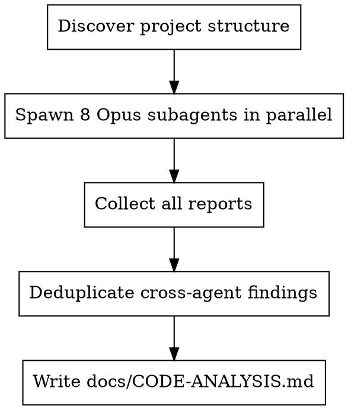

# Code Analysis

Orchestrates 8 parallel Opus subagents to analyze the codebase, each specializing in a different quality dimension. Aggregates findings into `docs/CODE-ANALYSIS.md`.

## When to Use

- User asks for a full code audit or quality analysis
- Before major refactoring to identify priorities
- Periodic codebase health check

## Process



## Step 1: Discover Project Structure

Before spawning agents, run a quick exploration to identify the actual source directories. Use `find` or `Glob` to confirm which packages exist and where their `src/` directories are. Pass accurate paths to each agent.

## Step 2: Spawn All 8 Subagents

Use a **single message** with **8 Agent tool calls** to launch all subagents in parallel.

Every subagent MUST use:
- `model: "opus"`
- `subagent_type: "general-purpose"` (they need Skill + all read tools)

### Agent Definitions

| # | Skill to Invoke | Target Paths | Analysis Focus |
|---|----------------|--------------|----------------|
| 1 | `typescript-expert` | `packages/types/src/`, `packages/core/src/`, `packages/desktop/src/`, `packages/mobile/` | Type safety, strict mode compliance, generic patterns, type architecture, `any` usage, missing return types |
| 2 | `nodejs-best-practices` | `packages/core/src/` | Async patterns, error handling, event loop blocking, security, process management, stream handling |
| 3 | `vercel-react-best-practices` | `packages/desktop/src/renderer/`, `packages/mobile/components/`, `packages/mobile/hooks/`, `packages/mobile/app/` | Component patterns, unnecessary re-renders, data fetching, memo/callback usage, key props, effect dependencies |
| 4 | `ui-ux-pro-max` | `packages/desktop/src/renderer/`, `packages/mobile/components/`, `packages/mobile/app/` | Accessibility (a11y), interaction patterns, visual hierarchy, responsive design, loading/error states, UX consistency |
| 5 | `tailwind-design-system` | `packages/desktop/src/renderer/` | Design token consistency, utility class patterns, responsive breakpoints, dark mode, custom CSS avoidance, class duplication |
| 6 | `senior-architect` | entire monorepo (all `packages/*/src/`) | Cross-package boundaries, dependency flow, circular deps, separation of concerns, API surface, integration patterns |
| 7 | `code-refactoring-refactor-clean` | `packages/core/src/`, `packages/desktop/src/`, `packages/mobile/` | SOLID violations, function/file size, naming quality, code duplication, abstraction levels, single responsibility |
| 8 | `code-refactoring-tech-debt` | entire monorepo | Tech debt inventory, deprecated patterns, TODO/FIXME/HACK audit, dependency freshness, dead code, migration needs |

### Subagent Prompt Template

Use this prompt for each subagent, filling in the `{placeholders}`:

```
You are a code analysis agent for the Mainframe project — an AI-native development environment (Electron + React + Node.js monorepo).

**Your expertise:** {skill_name}
**Your task:** Analyze the codebase for issues in your area of expertise.

**IMPORTANT:** Invoke the `{skill_name}` skill FIRST using the Skill tool to load your domain knowledge.

**Scope — ONLY analyze files under these paths:**
{target_paths_as_bullet_list}

Exclude: node_modules/, dist/, coverage/, build/, out/, .expo/, logs/, test-results/

**Instructions:**
1. Invoke the skill
2. Use Glob to discover all source files in your target paths (*.ts, *.tsx, *.css, etc.)
3. Read files systematically — prioritize larger files and entry points first
4. For each issue found, record:
   - **File path** and **line number(s)**
   - **Severity:** critical / high / medium / low
   - **Issue:** what is wrong
   - **Fix:** concrete suggestion

**Return your findings as markdown in this exact format:**

## {Dimension Name} Analysis

### Critical
- **`path/to/file.ts:42`** — Description of issue. **Fix:** How to fix it.

### High
- ...

### Medium
- ...

### Low
- ...

### Summary
- X critical, Y high, Z medium, W low issues found
- Top 3 priorities:
  1. ...
  2. ...
  3. ...

If a severity level has no issues, omit that section entirely.
Be thorough but precise — cite specific files and lines, not vague observations.
```

## Step 3: Aggregate Reports

After all 8 agents return, build the report:

1. **Parse** each agent's report to extract issue counts per severity
2. **Deduplicate** — if multiple agents flag the same file:line, keep the most specific finding and note which dimensions flagged it
3. **Rank** top priorities across all dimensions by severity (critical first)
4. **Write** the report to `docs/CODE-ANALYSIS.md`

### Report Template

Write `docs/CODE-ANALYSIS.md` with this structure:

```markdown
# Code Analysis Report

**Generated:** {YYYY-MM-DD}
**Analyzed by:** 8 specialized Opus subagents

## Executive Summary

| Dimension | Critical | High | Medium | Low | Total |
|-----------|----------|------|--------|-----|-------|
| TypeScript | | | | | |
| Node.js | | | | | |
| React | | | | | |
| UI/UX | | | | | |
| Tailwind | | | | | |
| Architecture | | | | | |
| Clean Code | | | | | |
| Tech Debt | | | | | |
| **Total** | | | | | |

## Top Priorities

{Top 10 issues across all dimensions, ranked by severity then impact. Deduplicated. Include which dimension(s) flagged each.}

1. **[critical]** `path:line` — Issue description *(flagged by: TypeScript, Clean Code)*
2. ...

## Detailed Reports

### TypeScript
{Full report from typescript-expert agent}

### Node.js
{Full report from nodejs-best-practices agent}

### React
{Full report from vercel-react-best-practices agent}

### UI/UX
{Full report from ui-ux-pro-max agent}

### Tailwind
{Full report from tailwind-design-system agent}

### Architecture
{Full report from senior-architect agent}

### Clean Code
{Full report from code-refactoring-refactor-clean agent}

### Tech Debt
{Full report from code-refactoring-tech-debt agent}
```

## Important Rules

- **All 8 agents in ONE message.** Do not spawn sequentially.
- **Opus model only.** Every agent uses `model: "opus"` for maximum analysis depth.
- **general-purpose subagent type.** Agents need the Skill tool, which Explore agents may lack.
- **Read the code, don't guess.** Agents must use Glob/Grep/Read extensively. Vague observations without file:line citations are worthless.
- **No fixes, only findings.** This skill produces a diagnostic report. Do not modify any source files.
- **Respect scope boundaries.** Each agent analyzes ONLY its assigned paths. A React agent reading `packages/core/` wastes context.
