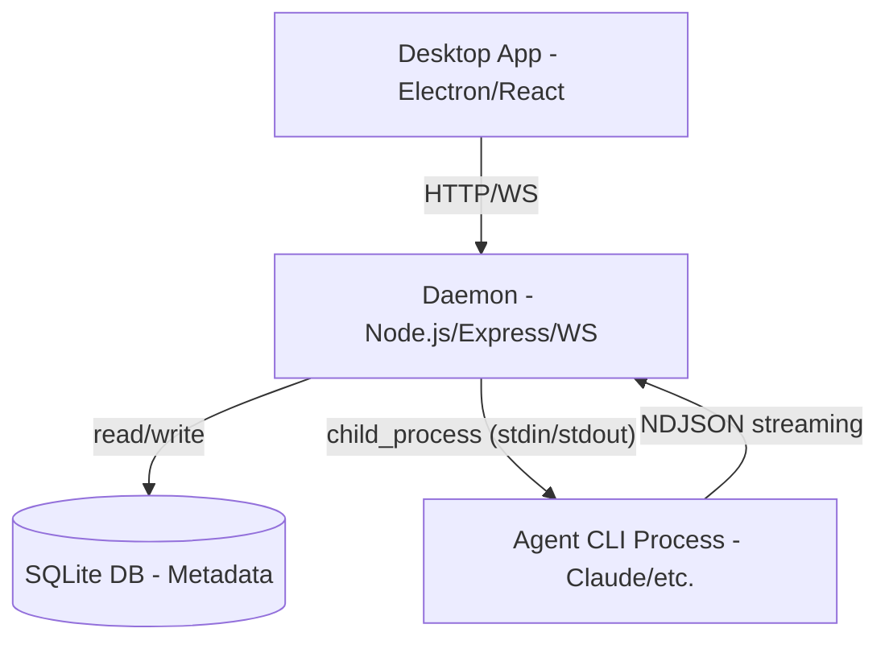

# Mainframe

AI-native development environment for orchestrating agents.

# Workflow
- Use Skills to guide your development see [Skills](#skills)
- For Claude CLI behavior, refer to [CLAUDE-JSONL-SCHEMA.md](docs/adapters/claude/CLAUDE-JSONL-SCHEMA.md), [PROTOCOL_REVERSED.md](docs/adapters/claude/PROTOCOL_REVERSED.md), and examples in `~/.claude/projects/**` and [CLAUDE-JSONL-SAMPLES](docs/adapters/claude/CLAUDE-JSONL-SAMPLES.md)
- Be sure to typecheck when you're done making a series of code changes
- Prefer running single tests, and not the whole test suite, for performance

## Tech Stack

- Language: TypeScript (strict mode, NodeNext modules)
- Runtime: Node.js 20+
- Package Manager: pnpm workspaces
- Database: SQLite (better-sqlite3)
- Desktop: Electron + React

## Commands

- `pnpm install` — Install dependencies
- `pnpm build` — Build all packages
- `pnpm --filter @mainframe/core build` — Build a specific package
- `pnpm test` — Run all tests
- `pnpm --filter @mainframe/core test` — Test a specific package

## Architecture

See [`docs/ARCHITECTURE.md`](docs/ARCHITECTURE.md) for the full design.

- **Monorepo Structure**: Uses pnpm workspaces with three main packages:
    - `@mainframe/types`: Shared TypeScript interfaces and domain models.
    - `@mainframe/core`: The background Daemon (Node.js). Responsible for process management, session lifecycle, and metadata storage.
    - `@mainframe/desktop`: The Frontend (Electron/React). Provides the user interface for chatting and workspace orchestration.
- **Facilitator Model**: The app manages CLI agent processes (like Claude CLI) via a structured JSON-RPC-like interface over stdio. It respects existing `~/.agents/` configurations and `CLAUDE.md` files in target projects.
- **Data Flow**: User Input (Desktop) → ChatManager (Daemon) → CLI Adapter (Process Stdin) → Agent Logic → NDJSON Events (Process Stdout) → Daemon Event Stream → UI Update (WebSocket).
- **Metadata Storage**: Uses SQLite (`better-sqlite3`) for project tracking and chat metadata (costs, tokens, session IDs). Message history is NOT duplicated; it is replayed by the CLI agents using `--resume` flags.

### Protocol References

- [`CLAUDE-JSONL-SCHEMA.md`](docs/adapters/claude/CLAUDE-JSONL-SCHEMA.md)
- [`PROTOCOL_REVERSED.md`](docs/adapters/claude/PROTOCOL_REVERSED.md)

## Terminology

- **AgentAdapter** — A CLI tool integration (Claude, Gemini, Codex, OpenCode). The daemon spawns these as child processes. Interface: `AgentAdapter` in `packages/types/src/adapter.ts`.
- **Agent / Subagent** — A task worker spawned _within_ a session by the AI (e.g., Claude's Task tool dispatching parallel subagents). Not the CLI adapters. The left panel "Agents" tab tracks these.

## Skills

Invoke the listed skill **before** taking the described action. No exceptions.

| Trigger | Skill |
|---------|-------|
| Any bug, error, or unexpected behavior — even when the cause looks obvious | `systematic-debugging` |
| Building a new feature, adding functionality, or changing behavior | `brainstorming` |
| Multi-step implementation task, or after brainstorming approval | `writing-plans` |
| Writing implementation code for any feature or bugfix | `test-driven-development` |
| About to claim work is done, commit, or open a PR | `verification-before-completion` |
| TS type errors, complex generics, or type architecture decisions | `typescript-expert` |
| Node.js architectural decisions or server-side patterns | `nodejs-best-practices` |
| Writing or reviewing React components, data fetching, or render perf | `vercel-react-best-practices` |
| Building UI components, pages, or making visual design decisions | `frontend-design`, `ui-ux-pro-max` |
| System architecture, integration patterns, or cross-package design | `senior-architect` |
| Writing docs, commits, PRs, error messages, or UI copy | `writing-clearly-and-concisely` |
| Creating READMEs, changelogs, ADRs, or structured docs | `documentation-templates` |

## Code Style

- **Comments**: Omit notes about removed or missing features. Focus on *why*, not *what*.
- **Strict TypeScript**: Uses strict mode with `NodeNext` module resolution and `noUncheckedIndexedAccess`.
- **Adapter-Provider Decoupling**: New agents must implement the `AgentAdapter` interface in `packages/types/src/adapter.ts`.
- **Stateless UI**: The desktop app is a "thin" client; business logic and pure functions belong in `@mainframe/core`, not `@mainframe/desktop`.

## Code Rules

These rules exist because every one was violated before and required cleanup. Follow them on every change.

### Security
- **No shell interpolation.** Use `execFile`/`execGit` with array args. Never `execSync` with template strings.
- **Validate all paths.** Use `resolveAndValidatePath()` (realpath + prefix check) before any file access from user input.
- **Validate user-provided names.** Skills, agents, and similar identifiers must match `^[a-zA-Z0-9_-]+$` via Zod schemas.
- **Zod on every endpoint.** All new API routes and WebSocket messages must validate input with Zod schemas.

### File & Function Size
- **Max 300 lines per file.** If a file exceeds this, decompose before merging.
- **Max 50 lines per function.** Extract helpers or split into sub-functions.
- **Decompose, don't grow.** When adding to a large file, check its size first. Prefer extracting a new module over appending.

### Error Handling & Logging
- **No silent catches.** Every `catch` block must log with context using `logger.warn`/`logger.error` (pino). The only exception is a `catch` with an explicit `/* new file */` or `/* expected */` comment explaining why silence is intentional.
- **No `console.log`/`console.error` in core.** Use the structured `pino` logger with child loggers (`createChildLogger`).
- **No `.catch(() => {})`.** Always log the error, even in fire-and-forget chains. Use `console.warn` with a tag in desktop code.

### Async I/O
- **No sync I/O in server code.** Use `node:fs/promises` (`readFile`, `readdir`, `stat`) and async `execGit`. Sync calls block the event loop.
- **No `execFileSync` in route handlers.** Use the promisified `execGit` helper.

### Architecture & Types
- **Single canonical type.** Never duplicate a type across packages. Define once in `@mainframe/types`, import everywhere.
- **Workspace deps only.** Desktop must depend on core via `workspace:*` in `package.json`. Never alias core source paths directly.
- **Pure logic in core.** Message parsing, status derivation, and data transforms belong in `@mainframe/core`, not in React components.

### Testing
- **New public methods need tests.** Route handlers, DB methods, and core logic must have corresponding test files.
- **Coverage thresholds enforced.** `vitest.config.ts` defines minimum coverage. Don't lower thresholds to pass CI.

### Performance
- **Lazy-load heavy components.** Large editors and visualizations must use `React.lazy()` with `Suspense`.
- **Cascade deletes.** When deleting parent entities (projects, chats), delete child records in a transaction.

### Hygiene
- **No `@ts-ignore`.** Use `@ts-expect-error` with a reason comment.
- **Remove unused deps and dead code.** Don't leave commented-out code, unused exports, or orphaned files.
- **Extract shared patterns.** If 3+ components duplicate logic, extract a shared helper or component.

## Environment Variables

| Variable | Description | Default |
|----------|-------------|---------|
| `PORT` | Daemon HTTP server port | 31415 |
| `LOG_LEVEL` | Logging verbosity | info |
