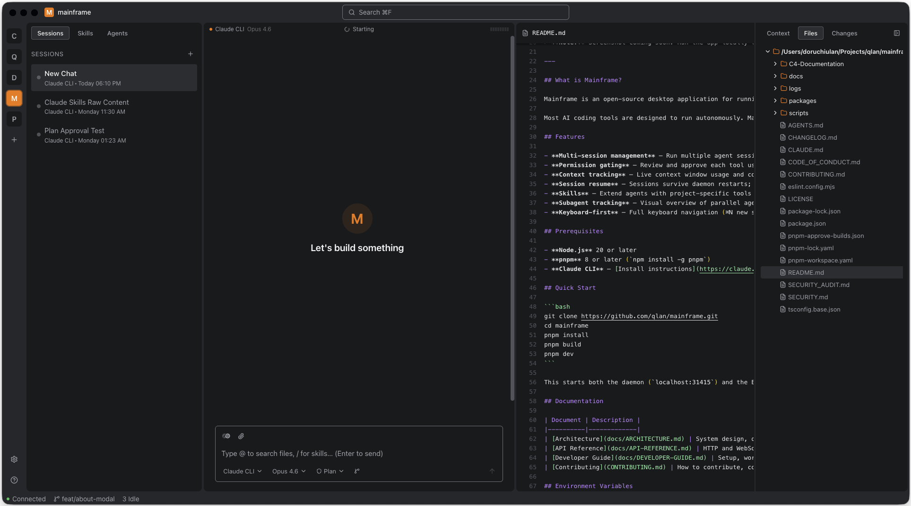

<h1 align="center">Mainframe</h1>

<p align="center">
  AI-native development environment for orchestrating agents
</p>

<p align="center">
  <a href="https://github.com/qlan-ro/mainframe/actions/workflows/ci.yml">
    
  </a>
  <a href="LICENSE">
    
  </a>
</p>

<p align="center">
  
</p>

---

## What is Mainframe?

Mainframe is an open-source desktop application for running, supervising, and orchestrating AI coding agents on your own machine. It wraps CLI-based agents (starting with Claude CLI) in a structured interface that keeps the engineer in control at every step.

Most AI coding tools are designed to run autonomously. Mainframe takes a different approach: you see what the agent is doing, approve each tool use before it executes, and can intervene at any point. It's a human-in-the-loop environment built for developers who want the speed of AI assistance without giving up oversight.

## Features

- **Multi-session management** — Run multiple agent sessions simultaneously with tabbed navigation
- **Permission gating** — Review and approve each tool use before it executes; never surprised by what ran
- **Context tracking** — Live context window usage and cost monitoring per session
- **Session resume** — Sessions survive daemon restarts; pick up exactly where you left off
- **Skills** — Extend agents with project-specific tools and instructions via `.claude/skills/`
- **Subagent tracking** — Visual overview of parallel agent tasks spawned within a session
- **Keyboard-first** — Full keyboard navigation (⌘N new session, ⌘F search, ⌘, settings)

## Prerequisites

- **Node.js** 20 or later
- **pnpm** 8 or later (`npm install -g pnpm`)
- **Claude CLI** — [Install instructions](https://claude.ai/code) (requires a Claude account)

## Quick Start

```bash
git clone https://github.com/qlan-ro/mainframe.git
cd mainframe
pnpm install
pnpm build
pnpm dev
```

This starts both the daemon (`localhost:31415`) and the Electron desktop app.

## Documentation

| Document | Description |
|----------|-------------|
| [Architecture](docs/ARCHITECTURE.md) | System design, data flow, package breakdown |
| [API Reference](docs/API-REFERENCE.md) | HTTP and WebSocket API for the daemon |
| [Developer Guide](docs/DEVELOPER-GUIDE.md) | Setup, workflow, monorepo conventions |
| [Contributing](CONTRIBUTING.md) | How to contribute, code standards, PR process |

## Environment Variables

All environment variables are optional — the application works without a `.env` file.

| Variable | Default | Description |
|----------|---------|-------------|
| `PORT` | `31415` | Daemon HTTP port |
| `LOG_LEVEL` | `info` | Logging verbosity (`debug`, `info`, `warn`, `error`) |
| `NODE_ENV` | `development` | Environment mode |

Copy `.env.example` to `.env` to customize.

## Contributing

See [CONTRIBUTING.md](CONTRIBUTING.md). Bug reports and feature requests go in [GitHub Issues](https://github.com/qlan-ro/mainframe/issues).

## License

[MIT](LICENSE) — © 2026 Mainframe Contributors
