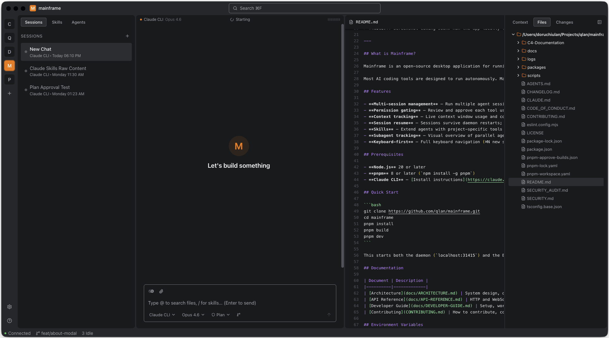
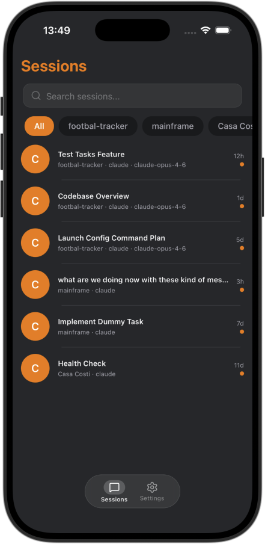

<h1 align="center">Mainframe</h1>

<p align="center">
  AI-native development environment for orchestrating agents
</p>

<p align="center">
  <a href="https://github.com/qlan-ro/mainframe/actions/workflows/ci.yml">
    
  </a>
  <a href="LICENSE">
    
  </a>
</p>

<p align="center">
  
  
</p>

---

## What is Mainframe?

Mainframe is an open-source desktop app that brings all your AI coding agents into one interface. Instead of juggling terminal windows, switching between your IDE and CLI, and losing track of what each agent is doing across projects — Mainframe gives you a single place to manage it all.

AI CLI tools are powerful, but they live in the terminal. Mainframe adds the layer terminals can't: visual file editing, live sandbox previews, task management, cross-project session history, and a mobile companion for working on the go.

## Features

- **Unified provider interface** — One app for Claude, Gemini, and other AI coding agents — switch providers without changing your workflow
- **Multi-project session management** — Run sessions across multiple projects with instant context switching and full session history
- **In-app file editing** — View and edit files, diffs, and code directly in Mainframe without switching to your IDE
- **Sandbox preview** — Launch dev servers and preview your app with a built-in browser and inspector for adding precise context
- **Task management** — Integrated kanban board to track agent work and your own todos alongside sessions
- **Content referencing** — @-mention files, add context on diff viewer, add context from the file editor, to give agents exactly the context they need
- **AI tools management** — Makes sure your project is AI ready. Handling Subagents, Skills, MCPs, context files.
- **Mobile companion** — Monitor and interact with your sessions from your phone — review, approve, and respond on the go
- **Extensible plugin system** — Add UI panels, databases, event listeners, and new AI adapters through a capability-based plugin API
- **API-first daemon** — Run the daemon standalone and build your own UI, integrations, or automations on top of its HTTP and WebSocket API

## Getting Started

### Desktop App

Download the latest release for your platform from [GitHub Releases](https://github.com/qlan-ro/mainframe/releases).

### Mobile Companion App

- [App Store](https://apps.apple.com/app/mainframe/id000000000)
- [Google Play](https://play.google.com/store/apps/details?id=com.qlan.mainframe)

**Pairing with your desktop:**

1. Open the desktop app and go to **Settings → Devices → Pair New Device**
2. A pairing code (and QR code) appears on screen
3. Open the mobile app, tap **Connect**, and scan the QR code or enter the code manually
4. The daemon issues a token — your phone is now paired and can send messages, respond to permissions, and receive push notifications

**Pairing from the CLI (headless/daemon-only):**

```bash
# Standalone binary
mainframe pair

# Docker
docker exec -it <container-name> node daemon.cjs pair
```

Both commands print a pairing code to the terminal. Enter it in the mobile app to complete pairing.

### Daemon Only

Install the standalone daemon if you want to run it headless or build your own interface:

```bash
curl -fsSL https://raw.githubusercontent.com/qlan-ro/mainframe/main/scripts/install.sh | bash
```

Or run it with Docker:

```bash
docker run -d -p 31415:31415 ghcr.io/qlan-ro/mainframe-daemon
```

#### Cloudflare Tunnel (remote access)

To access the daemon from the mobile app or another network, enable the built-in [Cloudflare Tunnel](https://developers.cloudflare.com/cloudflare-one/connections/connect-networks/) by setting `TUNNEL=true`. This requires `cloudflared` to be installed on the host.

```bash
# Standalone binary
TUNNEL=true mainframe

# Docker
docker run -d -p 31415:31415 -e TUNNEL=true ghcr.io/qlan-ro/mainframe-daemon
```

If you already have your own tunnel or reverse proxy, pass the public URL directly instead:

```bash
TUNNEL_URL=https://mainframe.example.com mainframe
```

### Prerequisites

Mainframe orchestrates AI coding agents — you'll need at least one installed:

- [Claude CLI](https://claude.ai/code) (requires a Claude account)
- [cloudflared](https://developers.cloudflare.com/cloudflare-one/connections/connect-networks/downloads/) (optional — only needed for remote/mobile access via tunnel)

## Development

See the [Developer Guide](docs/DEVELOPER-GUIDE.md) for full setup instructions.

```bash
git clone https://github.com/qlan-ro/mainframe.git
cd mainframe
pnpm install && pnpm build && pnpm dev
```

| Document | Description |
|----------|-------------|
| [Architecture](docs/ARCHITECTURE.md) | System design, data flow, package breakdown |
| [API Reference](docs/API-REFERENCE.md) | HTTP and WebSocket API for the daemon |
| [Developer Guide](docs/DEVELOPER-GUIDE.md) | Setup, workflow, monorepo conventions |
| [Plugin Developer Guide](docs/PLUGIN-DEVELOPER-GUIDE.md) | Build plugins: manifest, APIs, UI panels, events |
| [Contributing](CONTRIBUTING.md) | How to contribute, code standards, PR process |

## Plugin System

Mainframe is built to be extended. Plugins can add UI panels, store data in isolated databases, listen to daemon events, expose HTTP endpoints, and even register new AI CLI adapters.

**What ships built-in:**

- **Claude adapter** — the Claude CLI integration is itself a plugin
- **Task board** — the kanban task manager is a plugin with its own database, attachment storage, and fullview panel

**Build your own:** Write a `manifest.json` declaring your capabilities, export an `activate()` function in `index.js`, and drop it in `~/.mainframe/plugins/`. The daemon loads it on startup.

See the [Plugin Developer Guide](docs/PLUGIN-DEVELOPER-GUIDE.md) for the full API reference — manifest schema, database access, UI zones, event bus, attachments, config, services, and adapter integration.

We welcome plugin contributions. If you've built something useful, open a PR to include it as a builtin or share it with the community.

## Contributing

See [CONTRIBUTING.md](CONTRIBUTING.md). Bug reports and feature requests go in [GitHub Issues](https://github.com/qlan-ro/mainframe/issues).

## License

[MIT](LICENSE) — © 2026 Mainframe Contributors
