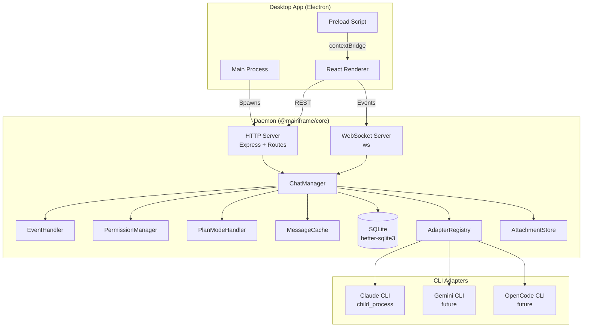
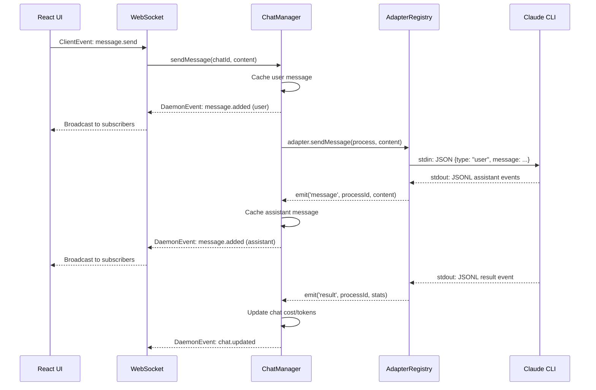
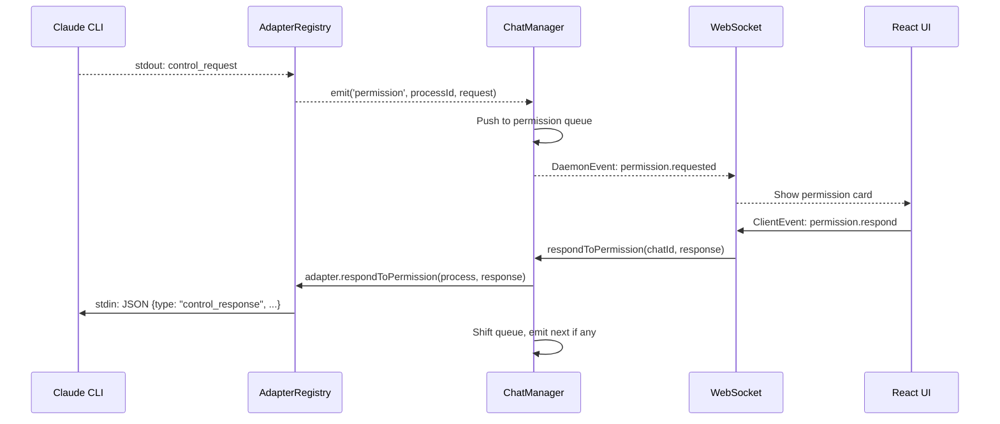
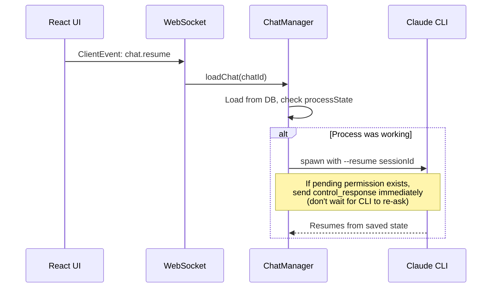

# Mainframe Architecture

> System architecture reference for the Mainframe AI development environment

## System Overview

Mainframe is a monorepo with three packages that form a layered architecture:

```
@mainframe/types   →  Shared TypeScript type definitions (zero runtime deps)
@mainframe/core    →  Node.js daemon (HTTP + WebSocket server)
@mainframe/desktop →  Electron + React application
```



## Package Architecture

### @mainframe/types

Pure TypeScript type definitions shared across all packages. Zero runtime dependencies.

| Module | Purpose |
|--------|---------|
| `adapter.ts` | `Adapter` interface, `SpawnOptions`, `AdapterProcess`, `PermissionRequest/Response` |
| `chat.ts` | `Chat`, `Project`, `ChatMessage`, `MessageContent` union type |
| `events.ts` | `DaemonEvent` (server→client), `ClientEvent` (client→server) |
| `api.ts` | `ApiResponse<T>` wrapper, REST API type interfaces |
| `skill.ts` | `Skill`, `AgentConfig`, `CreateSkillInput`, `CreateAgentInput` |
| `context.ts` | `SessionContext`, `ContextFile`, `SessionMention`, `SessionAttachment` |
| `settings.ts` | `PermissionMode`, `ProviderConfig` |

### @mainframe/core

Node.js daemon that manages CLI adapter processes and exposes APIs to frontends.

```
packages/core/src/
├── adapters/
│   ├── base.ts              # BaseAdapter abstract class
│   ├── claude.ts            # ClaudeAdapter implementation
│   ├── claude-events.ts     # CLI stdout/stderr parser
│   ├── claude-history.ts    # JSONL history loader
│   ├── claude-skills.ts     # Skills/agents CRUD
│   ├── claude-types.ts      # ClaudeProcess, ClaudeEventEmitter
│   ├── registry.ts          # AdapterRegistry
│   └── index.ts             # Barrel export
├── attachment/
│   ├── attachment-processor.ts
│   ├── attachment-store.ts
│   └── index.ts
├── chat/
│   ├── chat-manager.ts      # Central orchestrator
│   ├── context-tracker.ts   # Mention/file tracking
│   ├── event-handler.ts     # Adapter event wiring
│   ├── message-cache.ts     # In-memory message store
│   ├── permission-manager.ts # Permission queue
│   ├── plan-mode-handler.ts # ExitPlanMode state machine
│   ├── title-generator.ts   # AI title generation
│   ├── types.ts             # Shared types (ActiveChat)
│   └── index.ts
├── db/
│   ├── chats.ts
│   ├── database.ts
│   ├── projects.ts
│   ├── settings.ts
│   └── index.ts
├── server/
│   ├── http.ts              # Express app + CORS + error middleware
│   ├── websocket.ts         # WebSocketManager
│   ├── routes/
│   │   ├── adapters.ts
│   │   ├── agents.ts
│   │   ├── async-handler.ts
│   │   ├── attachments.ts
│   │   ├── chats.ts
│   │   ├── context.ts
│   │   ├── files.ts
│   │   ├── git.ts
│   │   ├── projects.ts
│   │   ├── settings.ts
│   │   ├── skills.ts
│   │   ├── types.ts
│   │   └── index.ts
│   └── index.ts
├── workspace/
│   ├── worktree.ts
│   └── index.ts
├── config.ts
└── index.ts
```

### @mainframe/desktop

Electron application with React frontend.

```
packages/desktop/src/
├── main/
│   └── index.ts                # Electron main process (daemon lifecycle, IPC)
├── preload/
│   └── index.ts                # contextBridge API (openDirectoryDialog, readFile)
└── renderer/
    ├── main.tsx                # React entry point
    ├── App.tsx                 # Root layout + keyboard shortcuts
    ├── lib/
    │   ├── client.ts           # DaemonClient singleton (WS + REST)
    │   ├── adapters.ts         # Adapter display utilities
    │   └── utils.ts            # Helper functions
    ├── hooks/
    │   ├── useDaemon.ts        # Daemon connection + event sync
    │   └── useConnectionState.ts
    ├── store/                  # Zustand state management
    │   ├── projects.ts         # Projects store
    │   ├── chats.ts            # Chats store + useChat() hook
    │   ├── ui.ts               # UI state (modals, panels)
    │   ├── tabs.ts             # Tab management
    │   ├── search.ts           # Search palette state
    │   ├── skills.ts           # Skills/agents state
    │   └── settings.ts         # Settings state
    └── components/
        ├── Layout.tsx
        ├── panels/             # Left, Right, Center panels
        ├── chat/               # Chat UI + assistant-ui integration
        │   └── assistant-ui/   # Custom message/tool renderers
        ├── center/             # Tab content (editor, diff, skills)
        └── ui/                 # Radix UI primitives
```

## Data Flow

### Message Lifecycle



### Permission Flow



**Permission Queue**: Claude CLI sends multiple `control_request` events in rapid succession when a single API turn contains multiple tool_use blocks. The queue ensures each request is handled sequentially — only the front of the queue is shown to the user.

### Session Resume Flow



## Storage Architecture

### SQLite Database (`~/.mainframe/mainframe.db`)

| Table | Purpose | Key Fields |
|-------|---------|------------|
| `projects` | Registered project directories | id, name, path, createdAt, lastOpenedAt |
| `chats` | Chat session metadata | id, adapterId, projectId, claudeSessionId, model, permissionMode, status, totalCost, totalTokens* |
| `settings` | Key-value configuration | category, key, value |

**WAL mode** enabled for crash safety and concurrent reads.

### Message Storage

Messages are **NOT stored in SQLite**. Each CLI agent persists its own conversation history:

- **Claude CLI**: `~/.claude/` directory, resumed via `--resume <sessionId>`
- Messages are cached in daemon memory for the session lifetime
- When a chat is resumed, the adapter's `loadHistory()` replays stored messages

### Attachments (`~/.mainframe/attachments/`)

```
~/.mainframe/attachments/
└── {chatId}/
    ├── {attachmentId}.json   # Metadata
    └── {attachmentId}.data   # Binary content (base64)
```

- Max 10 attachments per upload
- Max 5MB per attachment
- Types: `image` or `file` (auto-detected from mediaType)

## Adapter System

### Interface

Every CLI adapter implements the `Adapter` interface:

```typescript
interface Adapter {
  id: string;          // 'claude', 'gemini', etc.
  name: string;        // 'Claude CLI'

  // Discovery
  isInstalled(): Promise<boolean>;
  getVersion(): Promise<string | null>;

  // Lifecycle
  spawn(options: SpawnOptions): Promise<AdapterProcess>;
  kill(process: AdapterProcess): Promise<void>;
  interrupt?(process: AdapterProcess): Promise<void>;

  // Communication
  sendMessage(process: AdapterProcess, message: string, images?): Promise<void>;
  respondToPermission(process: AdapterProcess, response: PermissionResponse): Promise<void>;
  setPermissionMode?(process: AdapterProcess, mode: string): Promise<void>;
  setModel?(process: AdapterProcess, model: string): Promise<void>;

  // History
  loadHistory?(sessionId: string, projectPath: string): Promise<ChatMessage[]>;

  // Context
  getContextFiles?(projectPath: string): { global: ContextFile[]; project: ContextFile[] };

  // Skills & Agents (optional)
  listSkills?(projectPath: string): Promise<Skill[]>;
  createSkill?(projectPath: string, input: CreateSkillInput): Promise<Skill>;
  updateSkill?(skillId: string, projectPath: string, content: string): Promise<Skill>;
  deleteSkill?(skillId: string, projectPath: string): Promise<void>;
  listAgents?(projectPath: string): Promise<AgentConfig[]>;
  createAgent?(projectPath: string, input: CreateAgentInput): Promise<AgentConfig>;
  updateAgent?(agentId: string, projectPath: string, content: string): Promise<AgentConfig>;
  deleteAgent?(agentId: string, projectPath: string): Promise<void>;
}
```

### Claude CLI Adapter

The only adapter implemented in M1. Spawns Claude CLI as a child process with JSON streaming:

```
claude --output-format stream-json \
       --input-format stream-json \
       --verbose \
       --permission-prompt-tool stdio \
       [--resume <sessionId>] \
       [--model <model>] \
       [--permission-mode <mode>]
```

**Process flags**:
- `detached: false` — CLI dies with daemon (critical for consistent state)
- `FORCE_COLOR=0`, `NO_COLOR=1` — suppress ANSI escape codes

**JSONL events parsed from stdout**:
- `system` → init (session_id, model, tools)
- `assistant` → text, thinking, tool_use content blocks
- `user` → tool_result content blocks
- `result` → session end with cost/token stats

### Process Lifecycle States

```
starting → ready → running → stopped
                         ↘ error
```

| State | Meaning |
|-------|---------|
| `starting` | Process spawned, waiting for first output |
| `ready` | `system:init` received, session ID known |
| `running` | Actively processing messages |
| `stopped` | Process exited normally |
| `error` | Process exited with error |

## Event System

### DaemonEvent (Server → Client)

| Event | Payload | Trigger |
|-------|---------|---------|
| `chat.created` | `{ chat: Chat }` | New chat created |
| `chat.updated` | `{ chat: Chat }` | Chat metadata changed (cost, status, title) |
| `chat.ended` | `{ chatId }` | Chat session ended |
| `process.started` | `{ chatId, process }` | CLI process spawned |
| `process.ready` | `{ processId, claudeSessionId }` | CLI sent system:init |
| `process.stopped` | `{ processId }` | CLI process exited |
| `message.added` | `{ chatId, message }` | New message (user or assistant) |
| `messages.cleared` | `{ chatId }` | Message cache cleared (config change) |
| `permission.requested` | `{ chatId, request }` | Tool needs user approval |
| `context.updated` | `{ chatId }` | Session context changed |
| `error` | `{ chatId?, error }` | Error occurred |

### ClientEvent (Client → Server)

| Event | Payload | Action |
|-------|---------|--------|
| `chat.create` | `{ projectId, adapterId, model?, permissionMode? }` | Create + start chat |
| `chat.resume` | `{ chatId }` | Resume existing chat |
| `chat.end` | `{ chatId }` | End chat session |
| `chat.updateConfig` | `{ chatId, adapterId?, model?, permissionMode? }` | Change chat settings |
| `chat.interrupt` | `{ chatId }` | Send SIGINT to CLI |
| `chat.enableWorktree` | `{ chatId }` | Create git worktree |
| `chat.disableWorktree` | `{ chatId }` | Remove git worktree |
| `message.send` | `{ chatId, content, attachmentIds? }` | Send user message |
| `permission.respond` | `{ chatId, response }` | Approve/deny permission |
| `subscribe` | `{ chatId }` | Subscribe to chat events |
| `unsubscribe` | `{ chatId }` | Unsubscribe from chat events |

## Frontend Architecture

### State Management (Zustand)

| Store | State | Key Selectors |
|-------|-------|----------------|
| `projects` | Project list, active project | `activeProject`, `setActiveProject` |
| `chats` | Chat list, messages, permissions | `useChat(chatId)` → messages, send, respond |
| `ui` | Panel visibility, modals, image lightbox | `panelCollapsed`, `settingsOpen` |
| `tabs` | Open tabs, active tab | `openTab()`, `closeTab()`, `activeTab` |
| `search` | Search palette state | `isOpen`, `query`, `results` |
| `skills` | Skills/agents per adapter | `skills`, `agents`, `refresh()` |
| `settings` | Provider configs | `providerConfigs`, `updateProvider()` |

### assistant-ui Integration

Custom message rendering via `@assistant-ui/react` v0.12.9 (headless/Tailwind):

- `MainframeRuntimeProvider` — wraps `useExternalStoreRuntime` with custom `convertMessage`
- `MainframeThread` — custom thread component with primitives
- Tool card renderers for each Claude tool (Read, Write, Edit, Bash, Task, etc.)
- `getExternalStoreMessages<ChatMessage>()` to recover original message types inside renderers

## Git Worktree Support

Each chat can optionally operate in an isolated git worktree:

1. **Enable**: Creates `worktrees/{chatId}` branch + worktree in project
2. **CLI operates** in worktree path instead of main project path
3. **Disable**: Removes worktree + branch
4. **File APIs** use `chat.worktreePath` when set, falling back to `project.path`

## Configuration

### Default Ports

| Service | Port | Environment Variable |
|---------|------|---------------------|
| HTTP API + WebSocket | 31415 | `PORT` |

WebSocket upgrades happen on the same HTTP port — there is no separate WebSocket port.

### Data Directory

`~/.mainframe/` — created on first run.

```
~/.mainframe/
├── config.json       # Port overrides, preferences
├── mainframe.db      # SQLite database
└── attachments/      # Chat file attachments
```

### Permission Modes

| Mode | Behavior |
|------|----------|
| `default` | Ask user for every tool execution |
| `acceptEdits` | Auto-approve file edits, ask for others |
| `plan` | Plan mode — review before execution |
| `yolo` | Auto-approve everything |

## Deployment

### Development

```bash
# Terminal 1: Start daemon
pnpm dev:core

# Terminal 2: Start desktop
pnpm dev:desktop
```

Desktop connects to daemon at `http://127.0.0.1:31415`.

### Production

`pnpm package` builds the Electron app via `electron-builder`. The main process spawns the daemon automatically and kills it on app quit.

### Key Invariants

1. **Daemon owns all CLI processes** — processes die with the daemon (`detached: false`)
2. **Messages are ephemeral** — cached in daemon memory only, not persisted to DB
3. **CLI owns history** — session resume handled by `--resume` flag, not by replaying from DB
4. **Permission queue is ordered** — multiple requests from one API turn are queued, not overwritten
5. **WebSocket is subscription-based** — clients only receive events for chats they subscribe to
