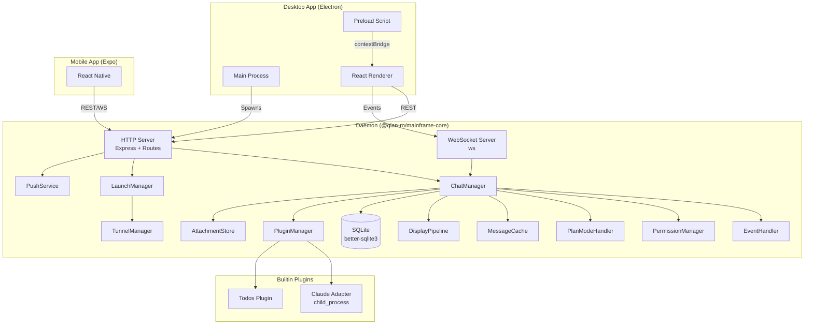
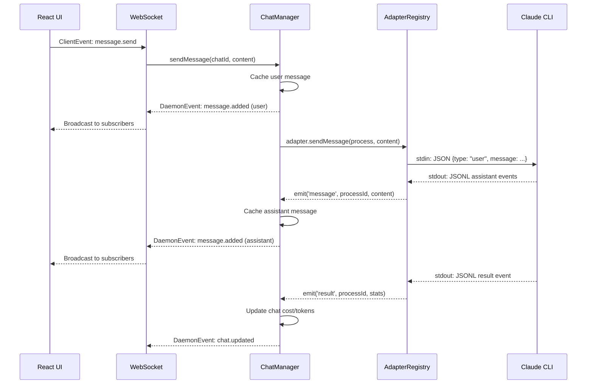
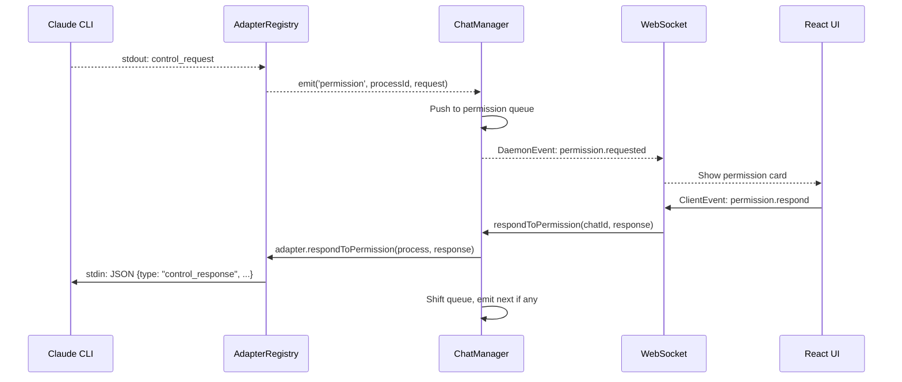
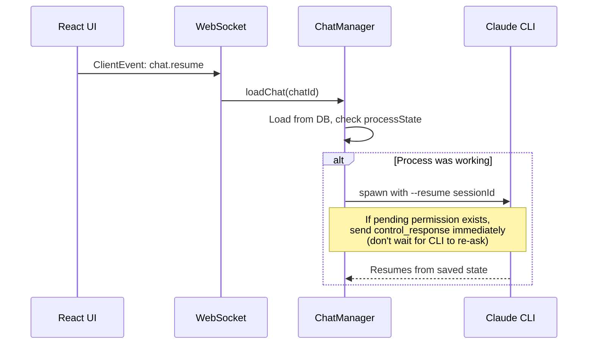

# Mainframe Architecture

> System architecture reference for the Mainframe AI development environment

## System Overview

Mainframe is a monorepo with five packages that form a layered architecture:

```
@qlan-ro/mainframe-types   →  Shared TypeScript type definitions (zero runtime deps)
@qlan-ro/mainframe-core    →  Node.js daemon (HTTP + WebSocket server)
@qlan-ro/mainframe-desktop →  Electron + React application
@qlan-ro/mainframe-mobile  →  React Native companion app (Private Repo)
@qlan-ro/mainframe-e2e     →  Playwright end-to-end tests
```


```mermaid
graph TB
    subgraph "Desktop App (Electron)"
        MainProcess[Main Process]
        Preload[Preload Script]
        Renderer[React Renderer]
    end

    subgraph "Mobile App (Expo)"
        MobileApp[React Native]
    end

    subgraph "Daemon (@qlan-ro/mainframe-core)"
        HTTP[HTTP Server<br/>Express + Routes]
        WS[WebSocket Server<br/>ws]
        CM[ChatManager]
        EH[EventHandler]
        PM[PermissionManager]
        PMH[PlanModeHandler]
        MC[MessageCache]
        DP[DisplayPipeline]
        DB[(SQLite<br/>better-sqlite3)]
        PLG[PluginManager]
        LM[LaunchManager]
        TM[TunnelManager]
        PS[PushService]
        AS[AttachmentStore]
        CM --> EH
        CM --> PM
        CM --> PMH
        CM --> MC
        CM --> DP
    end

    subgraph "Builtin Plugins"
        Claude[Claude Adapter<br/>child_process]
        Todos[Todos Plugin]
    end

    Renderer -->|REST| HTTP
    Renderer -->|Events| WS
    MobileApp -->|REST/WS| HTTP
    MainProcess -->|Spawns| HTTP
    Preload -->|contextBridge| Renderer

    HTTP --> CM
    WS --> CM
    CM --> DB
    CM --> PLG
    CM --> AS
    PLG --> Claude
    PLG --> Todos
    HTTP --> LM
    LM --> TM
    HTTP --> PS
```

## Package Architecture

### @qlan-ro/mainframe-types

Pure TypeScript type definitions shared across all packages. Zero runtime dependencies.

| Module | Purpose |
|--------|---------|
| `adapter.ts` | `Adapter` interface, `SpawnOptions`, `AdapterProcess`, `PermissionRequest/Response` |
| `chat.ts` | `Chat`, `Project`, `ChatMessage`, `MessageContent` union type |
| `command.ts` | `Command` definitions for custom slash commands |
| `context.ts` | `SessionContext`, `ContextFile`, `SessionMention`, `SessionAttachment` |
| `device.ts` | `Device`, `PairRequest` types for mobile pairing |
| `display.ts` | `DisplayMessage`, `DisplayTurn` for client-ready messages |
| `events.ts` | `DaemonEvent` (server→client), `ClientEvent` (client→server) |
| `launch.ts` | `LaunchConfig`, `LaunchStatus` for sandbox/dev server management |
| `plugin.ts` | `PluginManifest`, `PluginCapability`, `PluginPanelRegistration` |
| `settings.ts` | `PermissionMode`, `ProviderConfig` |
| `skill.ts` | `Skill`, `AgentConfig`, `CreateSkillInput`, `CreateAgentInput` |

### @qlan-ro/mainframe-core

Node.js daemon that manages CLI adapter processes and exposes APIs to frontends.

```
packages/core/src/
├── adapters/
│   └── index.ts              # AdapterRegistry
├── attachment/
│   ├── attachment-helpers.ts  # Attachment utilities
│   ├── attachment-store.ts    # Storage/retrieval
│   └── index.ts
├── auth/
│   └── token.ts              # JWT token generation/validation
├── chat/
│   ├── chat-manager.ts       # Central orchestrator (facade)
│   ├── config-manager.ts     # Per-chat configuration
│   ├── context-tracker.ts    # Mention/file tracking
│   ├── display-emitter.ts    # Formats messages for UI emission
│   ├── event-handler.ts      # Adapter event wiring
│   ├── external-session-service.ts  # External session import
│   ├── lifecycle-manager.ts  # Session start/stop/cleanup
│   ├── message-cache.ts      # In-memory message store
│   ├── permission-handler.ts # Permission request flows
│   ├── permission-manager.ts # Permission queue (FIFO)
│   ├── plan-mode-handler.ts  # ExitPlanMode state machine
│   ├── title-generator.ts    # AI title generation
│   ├── types.ts              # Shared types (ActiveChat)
│   └── index.ts
├── cli/
│   ├── pair.ts               # Device pairing command
│   └── status.ts             # Daemon status command
├── commands/
│   ├── registry.ts           # Custom command registry
│   └── wrap.ts               # Command execution wrapper
├── db/
│   ├── chats.ts
│   ├── database.ts
│   ├── devices.ts            # Device/pairing persistence
│   ├── projects.ts
│   ├── schema.ts             # SQLite schema definitions
│   ├── settings.ts
│   └── index.ts
├── launch/
│   ├── launch-config.ts      # Config parsing/validation
│   ├── launch-manager.ts     # Runtime launch execution
│   ├── launch-registry.ts    # Active launch tracking
│   └── index.ts
├── messages/
│   ├── display-helpers.ts    # Formatting utilities
│   ├── display-pipeline.ts   # Multi-stage message transform
│   ├── message-grouping.ts   # Groups tool_use with results
│   ├── message-parsing.ts    # Adapter NDJSON event parsing
│   ├── tool-categorization.ts # Tool type categorization
│   ├── tool-grouping.ts      # Consecutive tool grouping
│   └── index.ts
├── plugins/
│   ├── manager.ts            # Plugin lifecycle management
│   ├── context.ts            # PluginContext API surface
│   ├── event-bus.ts          # Plugin event bus
│   ├── ui-context.ts         # Plugin UI registration
│   ├── db-context.ts         # Per-plugin SQLite isolation
│   ├── security/
│   │   └── manifest-validator.ts
│   ├── services/
│   │   ├── chat-service.ts
│   │   └── project-service.ts
│   └── builtin/
│       ├── claude/            # Claude CLI adapter plugin
│       │   ├── adapter.ts
│       │   ├── events.ts
│       │   ├── history.ts
│       │   ├── session.ts
│       │   ├── skills.ts
│       │   └── index.ts
│       └── todos/
│           └── index.ts
├── push/
│   └── push-service.ts       # Push notification delivery
├── server/
│   ├── http.ts               # Express app + CORS + error middleware
│   ├── websocket.ts          # WebSocketManager
│   ├── middleware/
│   │   └── auth.ts           # JWT validation middleware
│   ├── routes/
│   │   ├── adapters.ts
│   │   ├── agents.ts
│   │   ├── attachments.ts
│   │   ├── auth.ts           # Device pairing/auth
│   │   ├── chats.ts
│   │   ├── commands.ts
│   │   ├── context.ts
│   │   ├── external-sessions.ts
│   │   ├── files.ts
│   │   ├── git.ts
│   │   ├── launch.ts
│   │   ├── projects.ts
│   │   ├── schemas.ts        # Shared Zod schemas
│   │   ├── settings.ts
│   │   ├── skills.ts
│   │   └── index.ts
│   └── index.ts
├── tunnel/
│   └── tunnel-manager.ts     # Cloudflare tunnel management
├── workspace/
│   ├── worktree.ts
│   └── index.ts
├── config.ts
├── logger.ts
└── index.ts
```

### @qlan-ro/mainframe-desktop

Electron application with React frontend.

```
packages/desktop/src/
├── main/
│   ├── index.ts                # Electron main process (daemon lifecycle, IPC)
│   └── logger.ts               # Main process logger
├── preload/
│   └── index.ts                # contextBridge API
└── renderer/
    ├── main.tsx                # React entry point
    ├── App.tsx                 # Root layout + keyboard shortcuts
    ├── lib/
    │   ├── client.ts           # DaemonClient singleton (WS + REST)
    │   ├── ws-event-router.ts  # WebSocket event routing
    │   ├── api/                # REST API client modules
    │   ├── adapters.ts         # Adapter display utilities
    │   ├── file-types.ts       # File type detection
    │   ├── launch.ts           # Launch config utilities
    │   ├── logger.ts           # Client-side pino logger
    │   └── utils.ts            # Helper functions
    ├── hooks/
    │   ├── useAppInit.ts       # App initialization
    │   ├── useChatSession.ts   # Chat session management
    │   ├── useConnectionState.ts
    │   └── useLaunchConfig.ts  # Launch config state
    ├── store/                  # Zustand state management
    │   ├── adapters.ts         # Adapter state
    │   ├── chats.ts            # Chats store + useChat() hook
    │   ├── plugins.ts          # Plugin state
    │   ├── projects.ts         # Projects store
    │   ├── sandbox.ts          # Sandbox/launch state
    │   ├── search.ts           # Search palette state
    │   ├── settings.ts         # Settings state
    │   ├── skills.ts           # Skills/agents state
    │   ├── tabs.ts             # Tab management
    │   ├── theme.ts            # Theme state
    │   ├── tutorial.ts         # Onboarding tutorial state
    │   └── ui.ts               # UI state (modals, panels)
    └── components/
        ├── Layout.tsx
        ├── panels/             # Left, Right sidebar panels
        ├── chat/               # Chat UI + assistant-ui integration
        │   └── assistant-ui/   # Custom message/tool renderers
        ├── center/             # Tab content (editor, diff, skills)
        ├── editor/             # Monaco editor integration
        ├── sandbox/            # Launch/preview UI
        ├── plugins/            # Plugin views
        ├── todos/              # Kanban task management
        ├── settings/           # Settings panels
        ├── viewers/            # File viewers (image, PDF, CSV, SVG)
        └── ui/                 # Radix UI primitives
```

### @qlan-ro/mainframe-mobile

React Native companion app built with Expo. Connects to the daemon over HTTP/WebSocket for remote session management.

- Pairs with the daemon via QR code or manual code entry
- Full chat interaction: send messages, respond to permissions, view tool output
- Push notifications for permission requests when the app is backgrounded
- Context picker for @-mentioning files

### @qlan-ro/mainframe-e2e

Playwright end-to-end test suite that runs against the full desktop app (daemon + Electron).

## Data Flow

### Message Lifecycle


```mermaid
sequenceDiagram
    participant UI as React UI
    participant WS as WebSocket
    participant CM as ChatManager
    participant AR as AdapterRegistry
    participant CLI as Claude CLI

    UI->>WS: ClientEvent: message.send
    WS->>CM: sendMessage(chatId, content)
    CM->>CM: Cache user message
    CM-->>WS: DaemonEvent: message.added (user)
    WS-->>UI: Broadcast to subscribers
    CM->>AR: adapter.sendMessage(process, content)
    AR->>CLI: stdin: JSON {type: "user", message: ...}

    CLI-->>AR: stdout: JSONL assistant events
    AR-->>CM: emit('message', processId, content)
    CM->>CM: Cache assistant message
    CM-->>WS: DaemonEvent: message.added (assistant)
    WS-->>UI: Broadcast to subscribers

    CLI-->>AR: stdout: JSONL result event
    AR-->>CM: emit('result', processId, stats)
    CM->>CM: Update chat cost/tokens
    CM-->>WS: DaemonEvent: chat.updated
```

### Permission Flow


```mermaid
sequenceDiagram
    participant CLI as Claude CLI
    participant AR as AdapterRegistry
    participant CM as ChatManager
    participant WS as WebSocket
    participant UI as React UI

    CLI-->>AR: stdout: control_request
    AR-->>CM: emit('permission', processId, request)
    CM->>CM: Push to permission queue
    CM-->>WS: DaemonEvent: permission.requested
    WS-->>UI: Show permission card

    UI->>WS: ClientEvent: permission.respond
    WS->>CM: respondToPermission(chatId, response)
    CM->>AR: adapter.respondToPermission(process, response)
    AR->>CLI: stdin: JSON {type: "control_response", ...}
    CM->>CM: Shift queue, emit next if any
```

**Permission Queue**: Claude CLI sends multiple `control_request` events in rapid succession when a single API turn contains multiple tool_use blocks. The queue ensures each request is handled sequentially — only the front of the queue is shown to the user.

### Session Resume Flow


```mermaid
sequenceDiagram
    participant UI as React UI
    participant WS as WebSocket
    participant CM as ChatManager
    participant CLI as Claude CLI

    UI->>WS: ClientEvent: chat.resume
    WS->>CM: loadChat(chatId)
    CM->>CM: Load from DB, check processState

    alt Process was working
        CM->>CLI: spawn with --resume sessionId
        Note over CM,CLI: If pending permission exists,<br/>send control_response immediately<br/>(don't wait for CLI to re-ask)
        CLI-->>CM: Resumes from saved state
    end
```

## Storage Architecture

### SQLite Database (`~/.mainframe/mainframe.db`)

| Table | Purpose | Key Fields |
|-------|---------|------------|
| `projects` | Registered project directories | id, name, path, createdAt, lastOpenedAt |
| `chats` | Chat session metadata | id, adapterId, projectId, claudeSessionId, model, permissionMode, status, totalCost, totalTokens* |
| `settings` | Key-value configuration | category, key, value |
| `devices` | Paired mobile devices | id, name, publicKey, token, createdAt |

**WAL mode** enabled for crash safety and concurrent reads.

### Message Storage

Messages are **NOT stored in SQLite**. Each CLI agent persists its own conversation history:

- **Claude CLI**: `~/.claude/` directory, resumed via `--resume <sessionId>`
- Messages are cached in daemon memory for the session lifetime
- When a chat is resumed, the adapter's `loadHistory()` replays stored messages

### Attachments (`~/.mainframe/attachments/`)

```
~/.mainframe/attachments/
└── {chatId}/
    ├── {attachmentId}.json   # Metadata
    └── {attachmentId}.data   # Binary content (base64)
```

- Max 10 attachments per upload
- Max 5MB per attachment
- Types: `image` or `file` (auto-detected from mediaType)

## Adapter System

### Interface

Every CLI adapter implements the `Adapter` interface:

```typescript
interface Adapter {
  id: string;          // 'claude', 'gemini', etc.
  name: string;        // 'Claude CLI'

  // Discovery
  isInstalled(): Promise<boolean>;
  getVersion(): Promise<string | null>;

  // Lifecycle
  spawn(options: SpawnOptions): Promise<AdapterProcess>;
  kill(process: AdapterProcess): Promise<void>;
  interrupt?(process: AdapterProcess): Promise<void>;

  // Communication
  sendMessage(process: AdapterProcess, message: string, images?): Promise<void>;
  respondToPermission(process: AdapterProcess, response: PermissionResponse): Promise<void>;
  setPermissionMode?(process: AdapterProcess, mode: string): Promise<void>;
  setModel?(process: AdapterProcess, model: string): Promise<void>;

  // History
  loadHistory?(sessionId: string, projectPath: string): Promise<ChatMessage[]>;

  // Context
  getContextFiles?(projectPath: string): { global: ContextFile[]; project: ContextFile[] };

  // Skills & Agents (optional)
  listSkills?(projectPath: string): Promise<Skill[]>;
  createSkill?(projectPath: string, input: CreateSkillInput): Promise<Skill>;
  updateSkill?(skillId: string, projectPath: string, content: string): Promise<Skill>;
  deleteSkill?(skillId: string, projectPath: string): Promise<void>;
  listAgents?(projectPath: string): Promise<AgentConfig[]>;
  createAgent?(projectPath: string, input: CreateAgentInput): Promise<AgentConfig>;
  updateAgent?(agentId: string, projectPath: string, content: string): Promise<AgentConfig>;
  deleteAgent?(agentId: string, projectPath: string): Promise<void>;
}
```

### Claude CLI Adapter

The Claude adapter is implemented as a builtin plugin at `plugins/builtin/claude/`. Spawns Claude CLI as a child process with JSON streaming:

```
claude --output-format stream-json \
       --input-format stream-json \
       --verbose \
       --permission-prompt-tool stdio \
       [--resume <sessionId>] \
       [--model <model>] \
       [--permission-mode <mode>]
```

**Process flags**:
- `detached: false` — CLI dies with daemon (critical for consistent state)
- `FORCE_COLOR=0`, `NO_COLOR=1` — suppress ANSI escape codes

**JSONL events parsed from stdout**:
- `system` → init (session_id, model, tools)
- `assistant` → text, thinking, tool_use content blocks
- `user` → tool_result content blocks
- `result` → session end with cost/token stats

### Process Lifecycle States

```
starting → ready → running → stopped
                         ↘ error
```

| State | Meaning |
|-------|---------|
| `starting` | Process spawned, waiting for first output |
| `ready` | `system:init` received, session ID known |
| `running` | Actively processing messages |
| `stopped` | Process exited normally |
| `error` | Process exited with error |

## Event System

### DaemonEvent (Server → Client)

| Event | Payload | Trigger |
|-------|---------|---------|
| `chat.created` | `{ chat: Chat }` | New chat created |
| `chat.updated` | `{ chat: Chat }` | Chat metadata changed (cost, status, title) |
| `chat.ended` | `{ chatId }` | Chat session ended |
| `process.started` | `{ chatId, process }` | CLI process spawned |
| `process.ready` | `{ processId, claudeSessionId }` | CLI sent system:init |
| `process.stopped` | `{ processId }` | CLI process exited |
| `message.added` | `{ chatId, message }` | New message (user or assistant) |
| `messages.cleared` | `{ chatId }` | Message cache cleared (config change) |
| `permission.requested` | `{ chatId, request }` | Tool needs user approval |
| `context.updated` | `{ chatId }` | Session context changed |
| `error` | `{ chatId?, error }` | Error occurred |
| `display.message.added` | `{ chatId, message }` | Display-ready message added |
| `display.message.updated` | `{ chatId, message }` | Display message updated |
| `display.messages.set` | `{ chatId, messages }` | Bulk display message set |
| `permission.resolved` | `{ chatId }` | Permission response sent |
| `plugin.panel.registered` | `{ panelId, pluginId }` | Plugin UI panel registered |
| `plugin.panel.unregistered` | `{ panelId }` | Plugin UI panel removed |
| `plugin.notification` | `{ pluginId, message }` | Plugin notification |
| `launch.output` | `{ projectId, name, data }` | Launch process output |
| `launch.status` | `{ projectId, name, status }` | Launch status change |
| `launch.tunnel` | `{ projectId, name, url }` | Tunnel URL available |
| `sessions.external.count` | `{ projectId, count }` | External session count |

### ClientEvent (Client → Server)

| Event | Payload | Action |
|-------|---------|--------|
| `chat.create` | `{ projectId, adapterId, model?, permissionMode? }` | Create + start chat |
| `chat.resume` | `{ chatId }` | Resume existing chat |
| `chat.end` | `{ chatId }` | End chat session |
| `chat.updateConfig` | `{ chatId, adapterId?, model?, permissionMode? }` | Change chat settings |
| `chat.interrupt` | `{ chatId }` | Send SIGINT to CLI |
| `message.send` | `{ chatId, content, attachmentIds? }` | Send user message |
| `permission.respond` | `{ chatId, response }` | Approve/deny permission |
| `subscribe` | `{ chatId }` | Subscribe to chat events |
| `unsubscribe` | `{ chatId }` | Unsubscribe from chat events |

## Frontend Architecture

### State Management (Zustand)

| Store | State | Key Selectors |
|-------|-------|----------------|
| `projects` | Project list, active project | `activeProject`, `setActiveProject` |
| `chats` | Chat list, messages, permissions | `useChat(chatId)` → messages, send, respond |
| `ui` | Panel visibility, modals, image lightbox | `panelCollapsed`, `settingsOpen` |
| `tabs` | Open tabs, active tab | `openTab()`, `closeTab()`, `activeTab` |
| `search` | Search palette state | `isOpen`, `query`, `results` |
| `skills` | Skills/agents per adapter | `skills`, `agents`, `refresh()` |
| `settings` | Provider configs | `providerConfigs`, `updateProvider()` |
| `adapters` | Adapter list, installation status | `adapters`, `fetchAdapters()` |
| `plugins` | Plugin panels, notifications | `panels`, `notifications` |
| `sandbox` | Launch configs, active launches | `launches`, `startLaunch()` |
| `theme` | Theme preferences | `theme`, `setTheme()` |
| `tutorial` | Onboarding state | `step`, `isComplete` |

### assistant-ui Integration

Custom message rendering via `@assistant-ui/react` v0.12.9 (headless/Tailwind):

- `MainframeRuntimeProvider` — wraps `useExternalStoreRuntime` with custom `convertMessage`
- `MainframeThread` — custom thread component with primitives
- Tool card renderers for each Claude tool (Read, Write, Edit, Bash, Task, etc.)
- `getExternalStoreMessages<ChatMessage>()` to recover original message types inside renderers

## Git Worktree Support

Each chat can optionally operate in an isolated git worktree:

1. **Enable**: Creates `worktrees/{chatId}` branch + worktree in project
2. **CLI operates** in worktree path instead of main project path
3. **Disable**: Removes worktree + branch
4. **File APIs** use `chat.worktreePath` when set, falling back to `project.path`

## Plugin System

Mainframe uses a capability-gated plugin architecture. Plugins declare required capabilities in their `manifest.json` and receive a scoped `PluginContext` at activation.

### Builtin Plugins

| Plugin | Purpose |
|--------|---------|
| `claude` | Claude CLI adapter — spawns and manages Claude CLI processes |
| `todos` | Kanban task management board |

### Plugin Capabilities

Plugins can request: `chats`, `projects`, `adapters`, `ui`, `db`, `attachments`, `config`. Each capability grants access to specific APIs through the `PluginContext`.

### Plugin Isolation

- Each plugin gets its own SQLite database at `~/.mainframe/plugins/{id}/data.db`
- Plugins receive sanitized `PublicDaemonEvent` events — never raw internal events
- Plugins cannot send messages into existing user chats (prompt injection prevention)

## Launch System

The launch system manages dev servers and sandbox processes within projects. Launch configs are defined in `.mainframe/launches.json` in each project.

- **LaunchConfig**: Defines command, working directory, environment variables, and port to detect
- **LaunchManager**: Spawns processes, streams output, detects when ports are ready
- **TunnelManager**: Creates Cloudflare tunnels to expose launched services (used by mobile companion)

## Mobile Pairing

The daemon supports device pairing for the mobile companion app:

1. Desktop generates a pairing code (QR or manual)
2. Mobile sends `POST /api/auth/pair` with the code
3. Daemon confirms and issues a JWT token
4. Mobile authenticates subsequent requests with the JWT
5. Push notifications are registered via `POST /api/auth/register-push`

## Configuration

### Default Ports

| Service | Port | Environment Variable |
|---------|------|---------------------|
| HTTP API + WebSocket | 31415 | `PORT` |

WebSocket upgrades happen on the same HTTP port — there is no separate WebSocket port.

### Data Directory

`~/.mainframe/` — created on first run.

```
~/.mainframe/
├── config.json       # Port overrides, preferences
├── mainframe.db      # SQLite database
├── attachments/      # Chat file attachments
└── plugins/          # Per-plugin isolated data
    └── {pluginId}/
        └── data.db   # Plugin-specific SQLite
```

### Permission Modes

| Mode | Behavior |
|------|----------|
| `default` | Ask user for every tool execution |
| `acceptEdits` | Auto-approve file edits, ask for others |
| `plan` | Plan mode — review before execution |
| `yolo` | Auto-approve everything |

## Deployment

### Development

```bash
# Terminal 1: Start daemon
pnpm dev:core

# Terminal 2: Start desktop
pnpm dev:desktop
```

Desktop connects to daemon at `http://127.0.0.1:31415`.

### Production

`pnpm package` builds the Electron app via `electron-builder`. The main process spawns the daemon automatically and kills it on app quit.

### Key Invariants

1. **Daemon owns all CLI processes** — processes die with the daemon (`detached: false`)
2. **Messages are ephemeral** — cached in daemon memory only, not persisted to DB
3. **CLI owns history** — session resume handled by `--resume` flag, not by replaying from DB
4. **Permission queue is ordered** — multiple requests from one API turn are queued, not overwritten
5. **WebSocket is subscription-based** — clients only receive events for chats they subscribe to
