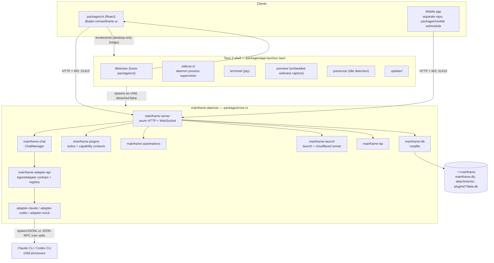

# Mainframe Architecture

> System architecture reference for the Mainframe AI development environment.
> For the full HTTP/WebSocket route and message catalog, see
> [`docs/API-REFERENCE.md`](API-REFERENCE.md). For Claude/Codex CLI protocol
> details, see `docs/adapters/claude/` and `docs/adapters/codex/`.

## System overview

Mainframe is a desktop app that drives coding-agent CLIs (Claude Code, Codex,
and a mock adapter for tests/demos) against local projects, and exposes the
same session state to a companion mobile app. Three pieces do the work:

1. **A Rust daemon** (`packages/core-rs`, binary `mainframe-daemon`) — an axum
   HTTP + WebSocket server that owns all state: projects, chats, adapter
   processes, git operations, launch/tunnel processes, automations, and the
   SQLite database. This is the only process that talks to the CLI tools.
2. **A Tauri 2 shell** (`packages/app-tauri/src-tauri`) — a thin Rust
   supervisor that spawns the daemon as a **sidecar child process**, hosts a
   webview, and provides desktop-native features (embedded terminal, preview
   webview capture, idle presence, auto-update) that don't belong in a
   headless daemon.
3. **A shared React renderer** (`packages/ui`, package name
   `@qlan-ro/mainframe-ui`) — the UI that runs inside the Tauri webview,
   consumed by `app-tauri` as a workspace dependency. It talks to the daemon
   over the same HTTP/WS port the mobile app uses; it does not talk to the
   Tauri shell except for a small set of desktop-only bridge calls
   (`packages/ui/src/lib/tauri/`).

This replaces an earlier Electron + Node.js daemon design (`mainframe-core`
on Express/`ws`, `mainframe-app-electron` on Electron, `better-sqlite3`) that
has been fully retired — see the "History" note at the end of this document.


```mermaid
graph TB
    subgraph Client["Clients"]
        UI["packages/ui (React)<br/>@qlan-ro/mainframe-ui"]
        Mobile["Mobile app<br/>separate repo, packages/mobile submodule"]
    end

    subgraph Shell["Tauri 2 shell — packages/app-tauri/src-tauri"]
        WebView["Webview (hosts packages/ui)"]
        Sidecar["sidecar.rs<br/>daemon process supervision"]
        Terminal["terminal/ (pty)"]
        Preview["preview/ (embedded webview capture)"]
        Presence["presence/ (idle detection)"]
        Updater["updater/"]
    end

    subgraph Daemon["mainframe-daemon — packages/core-rs"]
        Server["mainframe-server<br/>axum HTTP + WebSocket"]
        Chat["mainframe-chat<br/>ChatManager"]
        AdapterAPI["mainframe-adapter-api<br/>AgentAdapter contract + registry"]
        Adapters["adapter-claude / adapter-codex / adapter-mock"]
        Plugins["mainframe-plugins<br/>todos + capability contexts"]
        Automations["mainframe-automations"]
        Launch["mainframe-launch<br/>launch + cloudflared tunnel"]
        LSP["mainframe-lsp"]
        DB["mainframe-db<br/>rusqlite"]
    end

    Storage[("~/.mainframe<br/>mainframe.db, attachments/, plugins/*/data.db")]
    CLIs["Claude CLI / Codex CLI<br/>child processes"]

    WebView --> UI
    UI -- "invoke/emit (desktop-only bridge)" --> Shell
    Shell -- "spawns as child, detached:false" --> Daemon
    UI -- "HTTP + WS :31415" --> Server
    Mobile -- "HTTP + WS :31415" --> Server

    Server --> Chat
    Server --> Plugins
    Server --> Automations
    Server --> Launch
    Server --> LSP
    Server --> DB
    Chat --> AdapterAPI
    AdapterAPI --> Adapters
    Adapters -- "spawn/JSONL or JSON-RPC over stdio" --> CLIs
    DB --> Storage
```

## The Rust daemon (`packages/core-rs`)

The daemon is a Cargo workspace of 19 crates. `mainframe-daemon` is the only
binary; everything else is a library crate. The workspace is largely a
line-for-line Rust port of an earlier Node.js daemon that lived at
`packages/core` (see [History](#history-why-this-doc-changed) for that
package's current status) — most crate doc comments still say "ported from
`packages/core/src/...`", which is the most reliable source for what each
crate is responsible for.

### Layering

The crate graph has no cycles (verified from every crate's `Cargo.toml`).
Grouped into tiers by dependency depth — a tier only depends on tiers above
it, but not every crate in a tier depends on every crate in the tier above:

```
Tier 0  mainframe-types                        foundation: serde structs/enums, zero internal deps

Tier 1  mainframe-runtime          config, logging, auth, login-shell PATH capture
        mainframe-db               SQLite via rusqlite: migrations, repositories
        mainframe-git               git subprocess + porcelain parsers
        mainframe-display           adapter-agnostic message/tool display pipeline
        mainframe-background-tasks  spool tracking, process-group kill/liveness
        mainframe-claude-workflows  /workflows run store
        mainframe-launch            launch.json processes + cloudflared tunnels
        mainframe-lsp               WS<->stdio LSP proxy
        mainframe-automations       when-trigger / do-step automation engine
        mainframe-adapter-api       the AgentAdapter contract + registry

Tier 2  mainframe-services   workspace/attachment/push/todos/commands/notifications/
                             settings/files — cross-cutting (depends on types + db)
        mainframe-plugins    builtin plugin registry + capability contexts
                             (depends on runtime + services + adapter-api + git)
        mainframe-adapter-claude   Claude CLI: stream-json over stdio
        mainframe-adapter-codex    Codex CLI: app-server JSON-RPC
        mainframe-adapter-mock     fixture-replay adapter for tests/demos
                             (each adapter crate depends on adapter-api + display +
                              background-tasks, not on each other)

Tier 3  mainframe-chat       ChatManager: per-chat session orchestration
                             (depends on adapter-api, not the concrete adapter crates)

Tier 4  mainframe-server     axum HTTP app + WebSocket layer — aggregates nearly
                             every crate above (chat, all three adapters, plugins,
                             automations, launch, lsp, db, git, services)

Tier 5  mainframe-daemon     bin: boots everything mainframe-server aggregates
```

`mainframe-types` is the only crate every other crate can assume is present.

### What each crate owns

| Crate | Responsibility |
|---|---|
| `mainframe-types` | Shared serde types — one `.rs` module per type family (`chat`, `events`, `adapter`, `display`, `git`, `launch`, `lsp`, `plugin`, `settings`, `skill`, …). The Rust counterpart of `packages/types`. |
| `mainframe-runtime` | Process-level concerns: config load/merge (`$MAINFRAME_DATA_DIR`, `config.json`), logging setup, auth-secret handling, and login-shell `PATH` resolution (threaded explicitly into every child spawn — see [Boot sequence](#boot-sequence-and-process-ownership) for why). |
| `mainframe-db` | `DatabaseManager`, the migration runner, and repositories for `projects`, `chats`, `settings`, `devices`, `tags`, `chat_tags`. Synchronous `rusqlite` on one connection, matching the synchronous `better-sqlite3` API it replaced; async callers reach it through a `spawn_blocking`-backed `Db` handle in `mainframe-server::db`. |
| `mainframe-git` | The git subprocess primitive, porcelain-output parsers, `GitService`, and a per-project async lock so concurrent git commands on one repo serialize. |
| `mainframe-display` | The adapter-agnostic half of the message pipeline: tool categorization/grouping, unified-diff parsing, content truncation. Claude-specific message shapes live in `mainframe-adapter-claude` instead. |
| `mainframe-background-tasks` | Tracks long-running background tasks (spool files on disk), process-group kill, and liveness reconciliation after a daemon restart. |
| `mainframe-claude-workflows` | Server-side state for Claude's `/workflows` runs — seeded from `task_started`, updated via `task_progress`, reconciled against on-disk `wf_<runId>.json` records. |
| `mainframe-launch` | Runs `.mainframe/launches.json` dev-server/sandbox processes per project and manages `cloudflared` tunnels for exposing them (used by the mobile companion). |
| `mainframe-lsp` | Proxies a WebSocket connection to a spawned LSP server's stdio, for in-app language-server features. |
| `mainframe-automations` | The automations engine: when-triggers and linear do-steps executed over trait "ports," including GitHub issue/webhook integration. |
| `mainframe-adapter-api` | The `Adapter` trait (behavioral half of the `AgentAdapter` concept — see [Adapter system](#adapter-system-agentadapter)), the `AdapterRegistry`, and executable resolution. |
| `mainframe-services` | Cross-cutting daemon services that don't fit one domain crate: workspace/worktree helpers, attachment storage, push notifications, todo normalization, custom commands, file watching, provider settings. |
| `mainframe-plugins` | The builtin plugin registry and the capability-gated `PluginContext` (db/attachments/ui/events/config access). Only the builtin `todos` plugin loads here — Claude and Codex are native adapter crates, not plugins, and dynamic third-party JS plugin loading from the old Node daemon was **deliberately dropped** (the manifest/capability model is kept so a future WASM loader could restore it). |
| `mainframe-adapter-claude` | The Claude CLI integration: spawns `claude` with `stream-json` I/O, parses assistant/tool/result events, handles `control_request` permission prompts, reads JSONL session history for resume. |
| `mainframe-adapter-codex` | The Codex CLI integration: spawns Codex's app-server and speaks its JSON-RPC framing, including approval handling and rollout-file history. |
| `mainframe-adapter-mock` | A fixture-replay adapter with no real CLI — used by the E2E suite and local demos to produce deterministic adapter output. |
| `mainframe-chat` | `ChatManager` — the per-chat state machine tying an `AdapterSession` to cached display messages, the permission queue, context tracking, and config. One `Arc<Mutex<ChatState>>` per chat. |
| `mainframe-server` | The axum HTTP app, the WebSocket connection/broadcast layer, the response-envelope helpers, and every HTTP route (`src/routes/*.rs`) — chats, projects, git, launch, automations, skills, quota, tags, worktrees, and more. This is the crate `mainframe-daemon::main` wires together. Full route/message catalog: [`docs/API-REFERENCE.md`](API-REFERENCE.md). |
| `mainframe-daemon` | The `main.rs` binary: boots config → auth secret → DB → background-task tracker → adapter registry (Claude + Codex, static-seeded, then refreshed) → `ChatManager` → plugins → LSP → services → the HTTP/WS server, then runs a post-bind stray-child sweep, background-task reconciliation, and a liveness scheduler, with graceful `SIGINT`/`SIGTERM` shutdown. |

### Boot sequence and process ownership

`mainframe-daemon::main` is a single sequential boot (see the doc comment at
the top of `packages/core-rs/crates/mainframe-daemon/src/main.rs`): resolve
the login-shell `PATH` once, then load config → ensure an auth secret → open
the SQLite DB → start the
`BackgroundTaskTracker` → build the `AdapterRegistry` → build `ChatManager` →
load plugins → start LSP → wire cross-cutting services → bind the HTTP/WS
server. After bind, it sweeps stray children left by a previous crash,
reconciles background tasks, backfills worktree relationships, and starts the
liveness scheduler. Launch processes and the cloudflared tunnel share one
on-disk `FileChildRegistry` (`managed-children.json`) specifically so a
crashed daemon's *next* boot can reap everything the crash orphaned; a panic
hook does the same reaping before an abnormal exit.

The resolved login-shell `PATH` is threaded explicitly into every subsequent
child spawn (adapters, title generation, LSP, launch processes, background
tasks) as a function argument rather than by mutating the process
environment: the Node daemon this replaces set `process.env.PATH` directly,
but every crate here builds with `#![forbid(unsafe_code)]`, and mutating
process env is `unsafe` as of Rust edition 2024.

Every CLI child (Claude, Codex, LSP servers, launch processes) is spawned
non-detached — it dies when the daemon process dies. The `--version`, `pair`,
`status`, and `update` CLI subcommands are handled before any of this boot
sequence runs (either printing a version or acting as a thin HTTP client
against an already-running daemon).

## The Tauri shell (`packages/app-tauri/src-tauri`)

`packages/app-tauri` is the Tauri 2 desktop shell. It does **not** link
against `packages/core-rs` — the two are separate Cargo workspaces (see the
root `CLAUDE.md` "Disk Hygiene" section for why they're kept separate:
distinct dependency-feature graphs and workspace-wide profile settings like
`lto`/`panic = "abort"` that must not reach the daemon). Instead it spawns the
daemon binary as a **sidecar subprocess** and talks to it exactly like a
client would: HTTP + WebSocket on `DAEMON_PORT` (default `31415`).

This sidecar model directly continues how the old Electron shell worked —
`sidecar.rs`'s own doc comment says it "mirrors
`packages/app-electron/src/main/index.ts:startDaemon()`" — the daemon (Node,
then Rust) has always run as a separate process the desktop shell supervises,
not in-process code. That keeps the daemon usable headless (the mobile app
and `pair`/`status` CLI subcommands depend on this) and keeps the two
Cargo workspaces independently buildable and packageable.

Rust modules under `src-tauri/src/`:

| Module | Responsibility |
|---|---|
| `sidecar.rs` | Spawns and supervises the daemon child process; merges the resolved login-shell environment over the process env before spawn. Supports `MAINFRAME_EXTERNAL_DAEMON` to skip spawning and attach to a daemon the user started themselves. |
| `commands/` | `#[tauri::command]` handlers invoked from the webview (`app_info.rs`, `auth.rs`, `daemons.rs`, `fs.rs`) — desktop-native primitives like reading files, the app's OS keychain-backed daemon token, and multi-daemon bookkeeping. |
| `terminal/` | A native pty (embedded terminal pane in the Workspace surface). |
| `preview/` | Manages an embedded child webview used to preview a launched dev server, plus screen-region capture for it. |
| `presence/` | OS idle-time detection (macOS implementation + a stub for other platforms). |
| `updater/` | Auto-update channel resolution and error classification. |
| `mcp_bridge.rs` | Registers a `tauri-mcp` bridge plugin (dev/QA builds only, feature-gated) on a fixed loopback port so automated UI testing tools can drive the app. |

The webview loads `packages/ui`'s built assets and talks to the daemon
directly over HTTP/WS; the Tauri `invoke`/`emit` bridge is used only for the
desktop-native features above, via `packages/ui/src/lib/tauri/` — the single
module in the UI package allowed to know Tauri exists.

## The UI package (`packages/ui`)

`packages/ui` (`@qlan-ro/mainframe-ui`) is the shared React renderer, built
with Vite and consumed by `app-tauri` as a workspace dependency. Its own
`CLAUDE.md` is the authoritative depth reference for this package — this
section is a summary only.

- **Runtime**: a `useExternalStoreRuntime` (from `@assistant-ui/react`) fed by
  one controller per open chat, not `AssistantTransport`. The daemon is the
  single source of truth — there is no client-side message cache; drift is
  handled by refetching on a detected gap rather than a client cache or a
  server sequence number.
- **Two-surface model**: the app renders exactly two surface types, **Chat**
  and **Workspace** (Workspace merges what were once separate Files and Run
  surfaces — editor, diffs, viewers, terminals, and preview all live in one
  pane model). Multiple open sessions are chrome-style tabs within the Chat
  surface, not side-by-side chat panes.
- **Sessions list**: a global `useRemoteThreadListRuntime`, with native
  `ThreadListItemPrimitive` rows rendered inside the app's own
  grouped/filtered/pinned sidebar layout.
- **Design system**: shadcn/ui primitives + Tailwind v4 tokens
  (`src/styles/globals.css`); see the `mainframe-design-system` skill before
  changing markup or class names in this package.

For anything beyond this summary — the assistant-ui integration decisions,
composer/permission-gate architecture, tab/pane persistence model, and known
gaps — read `packages/ui/CLAUDE.md` directly rather than duplicating it here.

## Shared types (`packages/types`)

`@qlan-ro/mainframe-types` is the single canonical definition of every type
crossing a process boundary: `adapter.ts` (the `Adapter`/`AgentAdapter`
interface and `AdapterProcess`), `chat.ts`, `events.ts` (`DaemonEvent`/
`ClientEvent`), `display.ts`, `git.ts`, `launch.ts`, `lsp.ts`, `plugin.ts`,
`settings.ts`, `skill.ts`, and more. `packages/ui` depends on it via
`workspace:*`. `mainframe-types` (Rust) mirrors this file-for-file as serde
structs/enums — the two are kept in sync by hand, one `.rs` module per `.ts`
module, not generated from each other.

## Storage

SQLite via `rusqlite` (not `better-sqlite3` — that was the Node daemon's
driver and is gone), at `$MAINFRAME_DATA_DIR/mainframe.db`
(`MAINFRAME_DATA_DIR` defaults to `~/.mainframe`). WAL mode and foreign keys
are enabled on open (`mainframe-db`). The core schema is six tables:
`projects`, `chats`, `settings`, `devices`, `tags`, `chat_tags` — all owned by
`mainframe-db`'s repositories. Other subsystems (automations, plugins) reuse
the same connection through the shared `Db` actor handle rather than opening
their own files, **except** builtin plugins, which each get an isolated
SQLite file at `~/.mainframe/plugins/{pluginId}/data.db` for capability
isolation.

Chat message history is **not** duplicated into SQLite — each CLI adapter
owns its own transcript on disk (Claude's `~/.claude/` JSONL, Codex's own
session store) and the daemon replays it via the adapter's resume mechanism
(`--resume <sessionId>` for Claude) rather than reading its own cache back.
Attachments live under `~/.mainframe/attachments/{chatId}/`.

## Adapter system (`AgentAdapter`)

Per the project's Terminology convention: an **AgentAdapter** is a CLI tool
integration the daemon spawns as a child process (Claude, Codex, the mock
adapter) — distinct from an **Agent/Subagent**, which is a task worker an AI
spawns *within* a session (the UI's "Agents" tab).

The contract is `Adapter` in `packages/types/src/adapter.ts`, ported as a
Rust trait in `mainframe-adapter-api`. Every adapter implements installation
checks, model listing, session creation (`AdapterSession`), process kill, and
a set of optional capabilities (skills/agents CRUD, context files, custom
commands, title generation) — an adapter that doesn't support a capability
simply omits that method rather than stubbing it. The `AdapterRegistry`
(`mainframe-adapter-api`) tracks installed adapters and their catalogs;
`mainframe-daemon::main` always seeds it with `ClaudeAdapter` and
`CodexAdapter`, then refreshes it in the background. `MockCliAdapter` is
registered only when `E2E_MODE=mock` is set (the E2E suite and local demos),
never in a normal boot.

- `mainframe-adapter-claude` speaks Claude's `stream-json` protocol over
  stdio, including `control_request`/`control_response` permission
  round-trips. Protocol-level detail lives in `docs/adapters/claude/` — see
  the root `CLAUDE.md` for the current, verified set of docs there.
- `mainframe-adapter-codex` speaks Codex's app-server JSON-RPC protocol.
  Protocol-level detail lives in `docs/adapters/codex/`.
- `mainframe-adapter-mock` replays recorded fixtures instead of spawning a
  real CLI, for E2E tests and local demos.

`ChatManager` (`mainframe-chat`) is the layer above the registry: it owns one
state machine per chat, tying a live `AdapterSession` to the cached display
messages (via `mainframe-display`'s adapter-agnostic pipeline), the FIFO
permission queue, and session config.

## Daemon ↔ client transport

Both the desktop webview and the mobile app talk to the daemon over a single
port (`DAEMON_PORT`, default `31415`): plain HTTP REST for request/response
calls, and a WebSocket upgrade on the same port for subscriptions and
server-pushed events. There is no separate WebSocket port.

Most REST responses share one envelope, defined in `mainframe-server::respond`
(`ok`/`ok_empty`/`fail`):

```typescript
interface ApiResponse<T> {
  success: boolean;
  data?: T;
  error?: string;
}
```

A small number of routes deliberately return plain JSON instead of the
envelope — `GET /health` is one documented example, kept unwrapped and always
public (even through the auth middleware) so a single `curl` answers "who is
serving this port" without needing to unwrap a response first. Each such
exception is called out per-route in the API reference. The full REST route
catalog and every WebSocket
`DaemonEvent`/`ClientEvent` message shape are documented in
[`docs/API-REFERENCE.md`](API-REFERENCE.md); this document intentionally
does not re-enumerate them.

On the WebSocket side, a client authenticates on upgrade (a token query
param, unless connecting from loopback), receives a `connection.ready` first
frame, and then explicitly subscribes/unsubscribes to individual chats and
files. The server fans events out only to connections subscribed to the
relevant chat (or, for connection-global events, to every connection) — a
client never receives events for chats it hasn't subscribed to.

## Mobile (`packages/mobile`)

The mobile companion app lives in a **separate git repository**, vendored
into this monorepo as a submodule at `packages/mobile`. It co-owns the same
HTTP/WS contract the desktop UI uses, so changes to `mainframe-types`'
wire-facing types or to daemon routes/events must be **additive only** —
unknown fields are ignored by mobile, not rejected. Cross-cutting changes to
the mobile app itself need their own PR in that repository; don't bump the
submodule pointer as a side effect of a feature PR here.

## End-to-end tests (`packages/e2e`)

`@qlan-ro/mainframe-e2e` is a Playwright suite. It builds `packages/ui` once
and serves it from a shared, stateless Vite preview server, drives it with
Chromium, and talks to a real `mainframe-daemon` process built from
`packages/core-rs` — not a packaged Tauri window (Playwright cannot drive a
native webview directly). The daemon runs with `E2E_MODE=mock`, which
registers `mainframe-adapter-mock` as a real adapter choice so specs get
deterministic, recorded CLI behavior instead of live Claude/Codex calls. See
`pnpm test:e2e` in the root `CLAUDE.md` for how to run it; the suite's own
fixtures are the source of truth for scenario coverage, not this document.

## History: why this doc changed

This file previously described a five-package Electron + Node.js system —
`@qlan-ro/mainframe-core` as an Express/`ws` daemon, `@qlan-ro/mainframe-app-electron`
as the Electron app, and `better-sqlite3` for storage. That system was fully
replaced by the Rust daemon (`packages/core-rs`) and the Tauri 2 shell
(`packages/app-tauri`) described above. `packages/app-electron` and
`packages/desktop` are gone from the workspace entirely (no directory on
disk); a `packages/core/` directory still exists on disk, but it carries no
`package.json`, is not a pnpm workspace member, and its only tracked-adjacent
contents are stale build artifacts (`dist/`, `coverage/`, a leftover
`mainframe.db`) — it is not a live package. Nothing in this document reflects
that earlier design — if you find a stale cross-reference to it elsewhere in
the docs tree, it needs the same treatment this file just got.

## Open questions / not independently verified

- The exact set of WebSocket message-delivery guarantees under a lagging
  client (buffer depth, resync behavior) is described only at a high level
  above; `mainframe-server::websocket`'s broadcast-pump implementation is the
  source of truth for exact semantics if you need them.
- Automations' persistence (whether every automation table lives in the main
  `mainframe.db` versus a dedicated store) was confirmed only by a partial
  read of `mainframe-automations::store` — treat the "shared connection"
  claim above as directionally correct but not exhaustively verified against
  every table in that crate.
