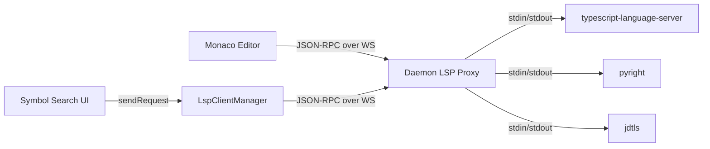

# LSP Proxy Design

Daemon-hosted LSP proxy that spawns language servers as child processes and forwards JSON-RPC over WebSocket to Monaco in the desktop app.

## Requirements

- Support TypeScript, Python, and Java (extensible to more languages)
- Bundle `typescript-language-server` and `pyright` as npm dependencies; expect `jdtls` pre-installed
- Lazy-start LSP servers on first need, auto-kill after 10 minutes idle
- Dedicated WebSocket endpoint per (project, language) — no mixing with chat traffic
- Thin proxy: daemon forwards bytes, desktop owns LSP client logic
- Enable Monaco features: go-to-definition, find-references, hover, completions, rename
- Expose `workspace/symbol` for project-wide symbol search (Cmd+P style)

## Architecture

```
Monaco ←→ monaco-languageclient ←→ WebSocket ←→ Daemon LSP proxy ←→ LSP server (stdio)
```



## Daemon: `packages/core/src/lsp/`

### `lsp-registry.ts` — Language → server config mapping

```ts
interface LspServerConfig {
  id: string;                    // 'typescript', 'python', 'java'
  languages: string[];           // file extensions: ['.ts', '.tsx', '.js', '.jsx']
  command: string;               // 'typescript-language-server' or resolved path
  args: string[];                // ['--stdio']
  bundled: boolean;              // true = resolve from node_modules
}
```

Three entries:

| Language | Server | Bundled | Command |
|----------|--------|---------|---------|
| TypeScript/JS | `typescript-language-server` | Yes | `node <resolved-path> --stdio` |
| Python | `pyright` | Yes | `node <resolved-path> --stdio` |
| Java | `jdtls` | No | `jdtls` (PATH lookup) |

Bundled servers resolve their entry point via `require.resolve()`. External servers are located via `execFile('command', ['-v', name])` (async, POSIX-portable).

### `lsp-manager.ts` — Lifecycle management

`LspManager` class responsibilities:

- Maintains `Map<string, LspServerHandle>` keyed by `${projectId}:${language}`
- `getOrSpawn(projectId, language, projectPath): Promise<LspServerHandle>` — returns existing or spawns new
- `shutdown(projectId, language)` — graceful shutdown (see below), then kills
- `shutdownAll()` — called on daemon shutdown, gracefully shuts down all servers
- `handleUpgrade(projectId, language, request, socket, head)` — handles WS upgrade for LSP connections
- `getAvailableLanguages()` — returns which LSP servers are installed
- `getActiveLanguages(projectId)` — returns which LSP servers are currently running for a project

**Types** are defined in `@qlan-ro/mainframe-types` (see Types section below). `LspServerHandle` is internal to core:

```ts
interface LspServerHandle {
  process: ChildProcess;
  language: string;
  projectPath: string;
  connectedClients: Set<WebSocket>;
  idleTimer: NodeJS.Timeout | null;
}
```

**Spawn race prevention:** Uses `Map<string, Promise<LspServerHandle>>` for in-flight spawns. Second concurrent caller awaits the same promise.

**Idle timeout:** 10-minute timer starts when last WS client disconnects. Any new connection cancels the timer. On timeout, graceful shutdown is initiated.

**Graceful shutdown sequence:**
1. Send LSP `shutdown` request to the server via stdin
2. Wait up to 3 seconds for the response
3. Send LSP `exit` notification
4. If the process hasn't exited after 2 more seconds, SIGTERM
5. Remove handle from manager

This prevents data corruption in servers that persist state (e.g. jdtls workspace caches).

**Single-client model:** Each LSP server accepts exactly one WebSocket client at a time. If a second client attempts to connect to the same `(projectId, language)`, the upgrade is rejected with HTTP 409 Conflict. This avoids the complexity of multi-client broadcasting and the fact that LSP servers are inherently single-client (one `initialize` handshake, one workspace state).

### `lsp-proxy.ts` — WebSocket ↔ stdio forwarding

Bidirectional JSON-RPC forwarding:

- **WS → stdin:** Reads JSON-RPC messages from WebSocket, wraps with `Content-Length: N\r\n\r\n` header, writes to process stdin
- **stdout → WS:** Uses `vscode-jsonrpc`'s `StreamMessageReader` to parse `Content-Length`-framed messages from stdout (handles partial reads, buffering, and multi-message chunks correctly). Forwards parsed JSON to WebSocket.
- **stderr:** Logged via pino, not forwarded

Using `StreamMessageReader`/`StreamMessageWriter` from `vscode-jsonrpc` avoids reimplementing the LSP framing protocol and its well-known edge cases (partial messages spanning `data` events, multiple messages per chunk).

On WS close: starts the idle timer on the handle (single-client model, so zero clients remain).

On process exit/error: closes the connected WebSocket, removes handle from manager, logs crash details.

### WebSocket routing

Changes to `websocket.ts` `setupUpgradeAuth`:

- After auth validation, inspect `request.url`
- If path matches `/lsp/:projectId/:language` → `lspManager.handleUpgrade(projectId, language, request, socket, head)`
- Otherwise → existing `this.wss.handleUpgrade(...)` for chat traffic

LSP WebSocket connections follow the same auth rules as chat WebSocket connections: localhost connections bypass auth when `AUTH_TOKEN_SECRET` is unset, remote/tunneled connections require a valid token via `?token=` query parameter.

LSP WebSocket connections are completely separate from chat WebSocket — different instances, no shared message parsing.

### REST endpoint

`GET /api/lsp/languages?projectId=xxx`

Query params validated with Zod:

```ts
const LspLanguagesQuerySchema = z.object({
  projectId: z.string().uuid(),
});
```

Response shape:

```ts
// Defined in @qlan-ro/mainframe-types
interface LspLanguageStatus {
  id: string;        // 'typescript', 'python', 'java'
  installed: boolean; // server binary found
  active: boolean;    // server currently running for this project
}
```

```json
{
  "languages": [
    { "id": "typescript", "installed": true, "active": true },
    { "id": "python", "installed": true, "active": false },
    { "id": "java", "installed": false, "active": false }
  ]
}
```

Desktop uses this to show language availability and can hint users to install missing servers.

### Server initialization and shutdown

- `LspManager` is created in `createServerManager` alongside `WebSocketManager`
- Passed to `WebSocketManager` constructor for upgrade routing
- `createServerManager.stop()` calls `lspManager.shutdownAll()` alongside existing cleanup

## Desktop: `packages/desktop/src/renderer/lib/lsp/`

### `lsp-client.ts` — LSP client manager

`LspClientManager` class:

- Maintains `Map<string, MonacoLanguageClient>` keyed by `${projectId}:${language}`
- `ensureClient(projectId, language): Promise<MonacoLanguageClient>`:
  1. Returns existing client if connected
  2. Opens WebSocket to `ws://localhost:${DAEMON_PORT}/lsp/${projectId}/${language}`
  3. Wraps with `toSocket()` → `WebSocketMessageReader`/`WebSocketMessageWriter` (from `vscode-ws-jsonrpc`)
  4. Creates `MonacoLanguageClient` with reader/writer
  5. Client sends LSP `initialize` with `workspaceFolders` (not deprecated `rootUri`) set to the project path
  6. Registers language feature providers with Monaco
- `disposeClient(projectId, language)` — tears down connection and deregisters providers
- `disposeAll()` — cleanup on app unmount

On WS close/error: removes client from map. On reconnection (next `ensureClient` call), the new client re-opens all currently visible documents via `textDocument/didOpen` so the LSP server rebuilds its workspace state. `monaco-languageclient` handles `textDocument/didOpen` and `textDocument/didChange` synchronization automatically — no custom code needed for document sync.

### `language-detection.ts` — File extension → LSP language mapping

Consolidates the existing extension → language mapping from `EditorTab.tsx`. Adds reverse lookup: given a file path, returns which LSP server ID to request.

```ts
function getLspLanguage(filePath: string): string | null
// '.ts' → 'typescript', '.py' → 'python', '.java' → 'java', '.rs' → null
```

### Monaco integration

`MonacoEditor.tsx` changes:

- On mount or when `filePath` changes, calls `lspClientManager.ensureClient(projectId, detectedLanguage)` for supported languages
- `monaco-languageclient` automatically registers providers (completion, hover, definition, references, rename, etc.)
- The existing custom `navigation.ts` definition provider becomes a fallback for languages without LSP support

### Symbol search

New hook or component for project-wide symbol search:

- Calls `client.sendRequest('workspace/symbol', { query })` on all active LSP clients for the current project
- Aggregates results across languages
- Renders in a command palette / picker UI
- Triggered by keyboard shortcut (Cmd+P or similar)

## Package dependencies

### `packages/core/package.json`

New dependencies:
- `typescript-language-server` — bundled LSP server for TS/JS
- `typescript` — peer dependency of the above (may already exist in monorepo)
- `pyright` — bundled LSP server for Python
- `vscode-jsonrpc` — `StreamMessageReader`/`StreamMessageWriter` for Content-Length framing

### `packages/desktop/package.json`

New dependencies:
- `monaco-languageclient` — connects Monaco editor to LSP
- `vscode-ws-jsonrpc` — WebSocket ↔ JSON-RPC message framing

## Error handling

### LSP server crashes

- `lsp-proxy.ts` listens for `exit`/`error` on the child process
- On crash: closes all connected WebSockets with error close code, removes handle from `LspManager`
- Logged with pino (`logger.error`) including exit code and stderr tail
- Next interaction from Monaco triggers fresh `ensureClient` → new WS → daemon re-spawns

### Project path validation

- `LspManager.handleUpgrade` validates `projectId` against DB, rejects with 404 if unknown
- Validates project path exists on disk before spawning using async `stat()` from `node:fs/promises` (not the sync `resolveAndValidatePath` — upgrade handlers must not block the event loop)

### Concurrent spawn race

- Two tabs opening `.ts` files simultaneously for the same project
- `getOrSpawn` uses in-flight promise map — second caller awaits same promise, no double-spawn

### Desktop reconnection

- Daemon restart drops all LSP WebSocket connections
- `LspClientManager` detects WS close, removes client from map
- Next Monaco interaction triggers `ensureClient` again — fully lazy, no reconnect loop

### Missing LSP server (jdtls)

- `GET /api/lsp/languages` reports Java as `installed: false`
- Desktop can show a hint to the user
- Opening `.java` files works normally, just without LSP features — no error, no broken UI

## Types: `@qlan-ro/mainframe-types`

New types added to the shared types package:

```ts
/** Language → server configuration (used by registry and REST responses) */
interface LspServerConfig {
  id: string;           // 'typescript', 'python', 'java'
  languages: string[];  // file extensions: ['.ts', '.tsx', '.js', '.jsx']
  command: string;      // server binary command
  args: string[];       // ['--stdio']
  bundled: boolean;     // true = shipped with mainframe-core
}

/** Per-language status for a project (REST response shape) */
interface LspLanguageStatus {
  id: string;
  installed: boolean;
  active: boolean;
}
```

`LspServerHandle` remains internal to `packages/core` — it contains `ChildProcess` and other node-specific types that the desktop should not depend on.

## File size considerations

`lsp-manager.ts` risks exceeding 300 lines since it handles lifecycle, spawning, upgrade routing, and idle timers. To stay within limits, split into:

- `lsp-manager.ts` — public API, handle map, `getOrSpawn`, `shutdown`, `getAvailableLanguages` (~150 lines)
- `lsp-connection.ts` — upgrade handling, client tracking, idle timer logic (~100 lines)
- `lsp-proxy.ts` — stdio ↔ WS forwarding (~80 lines)
- `lsp-registry.ts` — config entries and binary resolution (~60 lines)

## Test plan

### Unit tests

**`lsp-registry.test.ts`:**
- Returns correct config for each language ID
- Returns null/undefined for unknown language
- Bundled server binary resolution (mock `require.resolve`)
- External server detection (mock `execFile`)

**`lsp-manager.test.ts`:**
- `getOrSpawn` spawns new server for unknown key
- `getOrSpawn` returns existing handle for known key
- Concurrent `getOrSpawn` calls for same key await same promise (no double-spawn)
- `shutdown` sends graceful shutdown sequence then kills process
- `shutdownAll` shuts down all active servers
- Idle timer starts on last client disconnect
- Idle timer cancelled on new client connect
- Idle timer fires and kills server after timeout
- `getAvailableLanguages` returns installed status per language
- `getActiveLanguages` returns running servers for a project

**`lsp-connection.test.ts`:**
- Upgrade accepted for valid projectId + installed language
- Upgrade rejected with 404 for unknown projectId
- Upgrade rejected with 409 when client already connected
- Upgrade rejected with 404 for uninstalled language

**`lsp-proxy.test.ts`:**
- WS message forwarded to stdin with Content-Length framing
- Stdout message parsed and forwarded to WS
- Process exit closes WebSocket
- WS close triggers idle timer

### Integration tests

**`lsp-routes.test.ts`:**
- `GET /api/lsp/languages` returns correct installed/active status
- Query param validation rejects missing/invalid projectId

## New files

| File | Package | Purpose |
|------|---------|---------|
| `src/lsp/lsp-registry.ts` | core | Language → server config mapping |
| `src/lsp/lsp-manager.ts` | core | LSP server lifecycle (spawn, cache, idle kill) |
| `src/lsp/lsp-connection.ts` | core | Upgrade handling, client tracking, idle timers |
| `src/lsp/lsp-proxy.ts` | core | WebSocket ↔ stdio JSON-RPC forwarding |
| `src/lsp/index.ts` | core | Public exports |
| `src/server/routes/lsp-routes.ts` | core | `GET /api/lsp/languages` endpoint |
| `src/lsp.ts` | types | `LspServerConfig`, `LspLanguageStatus` types |
| `src/renderer/lib/lsp/lsp-client.ts` | desktop | MonacoLanguageClient manager |
| `src/renderer/lib/lsp/language-detection.ts` | desktop | File extension → LSP language mapping |
| `src/renderer/lib/lsp/index.ts` | desktop | Public exports |

## Modified files

| File | Change |
|------|--------|
| `packages/core/src/server/websocket.ts` | Route `/lsp/` upgrades to LspManager |
| `packages/core/src/server/index.ts` | Create LspManager, wire to WebSocketManager, shutdown |
| `packages/core/src/server/http.ts` | Mount lsp-routes |
| `packages/core/package.json` | Add typescript-language-server, typescript, pyright |
| `packages/desktop/package.json` | Add monaco-languageclient, vscode-ws-jsonrpc |
| `packages/desktop/src/renderer/components/editor/MonacoEditor.tsx` | Call ensureClient on file open |
| `packages/desktop/src/renderer/components/editor/navigation.ts` | Fallback-only for non-LSP languages |
